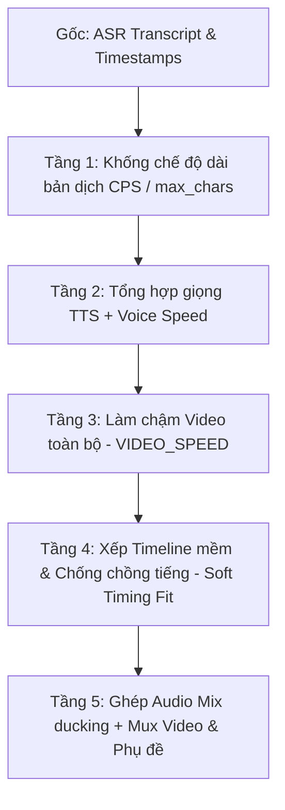

# Root Cause Analysis: Tính năng Khớp hình & Lời thoại (Audio-Video Sync & Timing)

## 1. Tổng quan & Đối chiếu với kho mã nguồn gốc `ttthanh2044/voxdub`

Sau khi thực hiện Reverse Engineering toàn bộ luồng xử lý âm thanh/hình ảnh/thời gian và đối chiếu từng tệp với kho gốc [`ttthanh2044/voxdub`](https://github.com/ttthanh2044/voxdub), kiến trúc khớp hình và lời thoại trong VoxDub bao gồm **5 tầng xử lý liên hoàn**:

---

## 2. Chi tiết 5 tầng khớp hình & lời thoại

### Tầng 1: Khống chế độ dài bản dịch trước khi đọc (`translate_hint.py` / `translate_direct.py`)
- **Nguyên lý**: Tiếng Việt có xu hướng dài hơn tiếng Trung/Anh từ 15% - 30%. Nếu bản dịch quá dài, TTS đọc tự nhiên sẽ không thể khít với thời lượng cảnh phim.
- **Cơ chế**:
  - `effective_cps(settings)`: Xác định tốc độ đọc tối đa an toàn (mặc định $14 - 16\text{ cps}$ - ký tự/giây).
  - `payload_segment(seg, cps)`: Tính `max_chars = duration * cps`.
  - Prompt AI yêu cầu: *Bắt buộc khống chế độ dài không vượt quá `max_chars`, dịch súc tích, thoát ý để vừa khít nhịp video*.

### Tầng 2: Tốc độ đọc giọng AI (`VOICE_SPEED` & `postprocess_voice_clips`)
- **Tệp**: `autodub/media/audio.py`
- **Cơ chế**:
  - Tùy chọn `VOICE_SPEED` (mặc định `1.0`, có thể chỉnh lên `1.05 - 1.15x`).
  - Gộp bộ lọc `atempo` vào khâu chuẩn hóa âm lượng (`loudnorm + highpass + fade`), loại bỏ khoảng lặng thừa đầu/đuôi câu.

### Tầng 3: Làm chậm video đồng đều (`VIDEO_SPEED` / `retime.py`)
- **Tệp**: `autodub/media/retime.py`
- **Nguyên lý cốt lõi của VoxDub**: **Không bao giờ cắt xén âm thanh hay co giật từng đoạn video lẻ tẻ**. Thay vào đó, toàn bộ video và nhạc nền được làm chậm đồng đều theo 1 hệ số `VIDEO_SPEED` (ví dụ `0.85x` hoặc `0.90x`):
  - Video gốc 100s ở `0.85x` sẽ kéo dài thành `~117.6s`.
  - `rescale_segments`: Nhân mốc thời gian của toàn bộ câu thoại với tỷ lệ giãn $\frac{1}{\text{speed}}$. Nhờ đó, câu thoại tiếng Việt có đủ không gian thời gian mà không bị nói dồn dập.

### Tầng 4: Sắp xếp Timeline mềm & Chống chồng tiếng (`soft_timing_fit` / `timing.py`)
- **Tệp**: `autodub/media/timing.py`
- **Thuật toán `plan_placements`**:
  1. **Ưu tiên 1 (Dồn trễ - Shift)**: Nếu câu đọc dài hơn phân đoạn gốc, câu sau sẽ lùi lại bắt đầu ở khoảng lặng kế tiếp (`t = max(natural, prev_end + min_gap_s)`). Giới hạn dồn trễ tối đa `timing_max_drift_s` (mặc định `1.5s`). Giữ nguyên 100% tốc độ đọc tự nhiên.
  2. **Ưu tiên 2 (Nén nhẹ bất khả kháng - Compression)**: Nếu dồn trễ đã chạm trần `1.5s` mà câu tiếp theo vẫn bị ép, nén nhẹ câu đó bằng `atempo` tối đa `timing_max_atempo` (mặc định `1.1x` — ngưỡng tai người khó nhận biết).
  3. **Ưu tiên 3 (Ghi nhận & Báo cáo - Overlap)**: Nếu sau 2 bước vẫn còn tràn, ghi nhận vào `quality_report.json` và `timing_guide.json`.
- `apply_soft_timing`: Cập nhật lại `seg["start"]` và `seg["end"]` thực tế sau khi dồn trễ.

### Tầng 5: Ghép âm thanh & Muxing Video (`audio.py`, `video.py`, `subtitles.py`)
- **Tệp**: `autodub/media/audio.py`, `autodub/media/video.py`
- Trộn giọng đọc theo đúng timeline thật (`segments_timed`) đè lên nhạc nền có ducking Cosine S-curve mượt mà.
- Phụ đề (.srt / .ass karaoke) được làm mới theo đúng `segments_timed` để chữ chạy khớp 100% với giọng đọc.

---

## 3. Các điểm bất thường và nguyên nhân gốc (Root Causes)

Qua kiểm tra đối chiếu mã nguồn thực tế:

### 🔴 Nguyên nhân 1: Chưa áp dụng cơ chế `auto_fit` linh hoạt khi `soft_timing_fit` bị tắt hoặc quá tải
- Khi người dùng có video thoại dày đặc (không có khoảng lặng để dồn trễ), nếu `timing_max_drift_s` (1.5s) bị kịch trần và `timing_max_atempo` (1.1x) không đủ nén, các câu thoại vẫn bị chồng lên nhau (`overlap_prev > 0`).
- Nếu không bật `VIDEO_SPEED < 1.0`, các câu thoại dài sẽ bị dồn đuôi hoặc chồng tiếng vào câu tiếp theo.

### 🔴 Nguyên nhân 2: Lệch mốc thời gian giữa Audio và Video khi Audio dài hơn Video
- Trong `autodub/media/video.py` (`merge_video`), lệnh `ffmpeg` không có cờ `-shortest` hoặc pad video.
- Khi bản lồng tiếng tổng thể (`total_duration`) dài hơn thời lượng video gốc, video sẽ bị đứng hình ở frame cuối cùng trong khi audio tiếp tục chạy hết câu thoại.

### 🔴 Nguyên nhân 3: Mối liên kết giữa Trình chỉnh sửa (Editor) và Thiết lập dự án
- Trong `autodub_gui/pages/editor_export.py` và `autodub/editor.py`: Khi người dùng sửa câu trong Editor làm tăng độ dài câu, nếu không kích hoạt lại `apply_soft_timing`, mốc thời gian của câu sau không tự động dồn trễ, dẫn đến câu vừa sửa đè lên câu kế tiếp.

---

## 4. Kết luận & Đề xuất giải pháp (Solution Outline)

1. **Chuẩn hóa & Tối ưu thuật toán `plan_placements`**:
   - Thêm cơ chế cảnh báo trực quan trên giao diện khi phát hiện câu thoại bị chồng tiếng (`overlap`).
   - Tự động gợi ý hạ `VIDEO_SPEED` (ví dụ từ `1.0` xuống `0.88` hoặc `0.85`) khi tỷ lệ chồng tiếng cao.
2. **Đồng bộ hóa video length**:
   - Xử lý mượt mà đoạn kết thúc video khi audio dài hơn video (tự động kéo dài frame cuối có fade out hoặc tùy chọn loop/freeze tinh tế).
3. **Đảm bảo toàn bộ luồng Editor & Pipeline gọi chung `apply_soft_timing` và `refresh_subtitles`**.

---

**TRẠNG THÁI HIỆN TẠI:** `TRẠNG THÁI: CHỜ DUYỆT NGUYÊN NHÂN`
