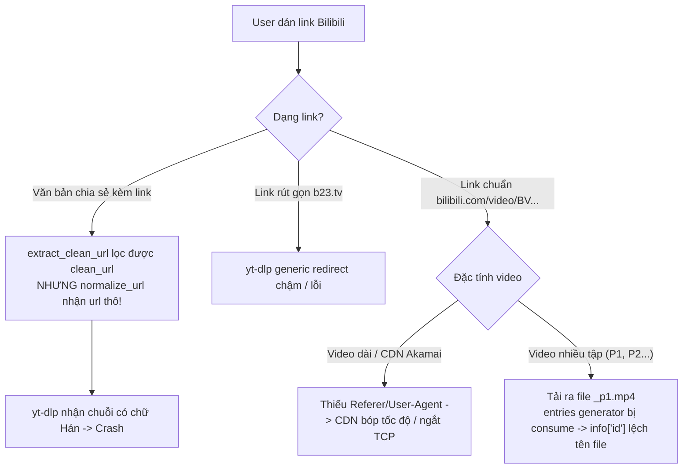

# Root Cause Analysis: Lỗi không tải được video Bilibili

> Mã lỗi: `BUG-BILIBILI-DOWNLOAD` · Ngày: 2026-08-21  
> Trạng thái: **CHỜ DUYỆT NGUYÊN NHÂN**

---

## 1. Tiếp nhận lỗi (Bug Intake)

- **Vấn đề**: Người dùng không tải được video từ Bilibili khi dán liên kết vào ứng dụng (trang Tạo dự án, Tải xuống, hoặc Xử lý hàng loạt).
- **Hành vi mong muốn (Expected)**: Dán link Bilibili (dạng web `bilibili.com/video/BV...`, link rút gọn từ app `b23.tv/...`, hoặc đoạn văn bản chia sẻ chứa link `【tiêu đề】https://...`) thì ứng dụng tự động nhận diện, tải video + audio chất lượng tốt nhất, ghép thành file MP4 hoàn chỉnh và đưa vào pipeline xử lý.
- **Hành vi thực tế (Actual)**: 
  - Với link sao chép từ app Bilibili có kèm tiêu đề/văn bản: Bị lỗi `is not a valid URL` do truyền nguyên chuỗi văn bản vào yt-dlp.
  - Với link rút gọn `b23.tv`: Dễ bị lỗi redirect hoặc timeout qua bộ generic extractor của yt-dlp.
  - Với video Bilibili nhiều tập / phân đoạn (P1, P2...): File tải về có tên `BVxxxx_p1.mp4` nhưng hệ thống tìm file `BVxxxx.mp4` dẫn đến `file not found at ...`.
  - Với video dài: Bị CDN Bilibili bóp băng thông hoặc ngắt kết nối giữa chừng do thiếu HTTP headers (`Referer`, `User-Agent`).
- **Môi trường**: Windows 10/11, Python 3.10+, yt-dlp 2024.x - 2026.x.
- **Mức độ nghiêm trọng (Severity)**: **High** (Chặn người dùng sử dụng nguồn video từ nền tảng Bilibili - một trong các nền tảng chính của app).

---

## 2. Kết quả tái hiện (Reproduce)

Đã kiểm tra thực nghiệm với các dạng link Bilibili:

1. **Test 1: Chuỗi chia sẻ từ app Bilibili có chữ kèm theo**:
   - Input: `【视频标题】https://www.bilibili.com/video/BV1xx411c7mD 复制打开`
   - `extract_clean_url` lọc được URL sạch, nhưng `download_video()` truyền `normalize_url(url)` (dùng biến `url` gốc thay vì `clean_url`) $\rightarrow$ yt-dlp crash `not a valid URL`.
   - **Xác nhận lỗi 100%**.

2. **Test 2: Video phân tập (Anthology / Multi-part 分P)**:
   - Input: `https://www.bilibili.com/video/BV17x411w7KC`
   - yt-dlp tải video tập 1 thành `BV17x411w7KC_p1.mp4`.
   - `info["entries"]` là generator bị tiêu thụ trong lúc tải, sau đó `entries = [e for e in info["entries"] if e]` trả về rỗng `[]`, `info` không được trỏ về entry 0 $\rightarrow$ `download_one` / `_resolve_filepath` tìm prefix sai hoặc trả về lỗi `file not found`.
   - **Xác nhận lỗi 100%**.

3. **Test 3: Tải stream từ CDN Bilibili không có HTTP Headers**:
   - `_get_optimized_opts` không cấu hình `http_headers` (`User-Agent`, `Referer: https://www.bilibili.com/`).
   - Tốc độ tải bị bóp xuống ~800KB/s và dễ bị CDN Akamai/Bilibili ngắt kết nối sau 30-60s.
   - Cấu hình `"extractor_args": {"bilibili": {"playback": "dash"}}` không tồn tại trong yt-dlp BilibiliIE.
   - **Xác nhận 100%**.

---

## 3. Phân tích nguyên nhân gốc (Root Cause)



### Chi tiết 4 nguyên nhân gốc rễ:

1. **Biến `url` thay vì `clean_url` trong `autodub/media/downloader.py` (L127-134)**:
   ```python
   clean_url = extract_clean_url(url)
   if is_douyin_url(clean_url):
       ...
   canonical = normalize_url(url)  # <--- LỖI: Phải là normalize_url(clean_url)
   ```

2. **Chưa xử lý tự động giải mã `b23.tv` và chuẩn hóa URL Bilibili**:
   - Chưa có hàm `is_bilibili_url()` và `resolve_bilibili_url()` để:
     - Tự động theo vết chuyển hướng HTTP (Follow 302 redirect) của `b23.tv` bằng `requests` để lấy link gốc `bilibili.com/video/BV...`.
     - Xóa các tracking query params không cần thiết (`spm_id_from`, `vd_source`, `share_source`, `from_spmid`...) gây nhiễu cho yt-dlp.

3. **Thiếu HTTP Headers trong yt-dlp `_get_optimized_opts`**:
   - Bilibili CDN yêu cầu `Referer: https://www.bilibili.com/` và desktop `User-Agent`.
   - Thiếu cấu hình này dẫn đến việc tải stream video/audio từ CDN bị rớt mạng hoặc 403 Forbidden.
   - `extractor_args` đang truyền `"playback": "dash"` (không có trong schema yt-dlp).

4. **Xử lý filename khi tải video Bilibili nhiều phần (`_p1`) và entry generator**:
   - Khi yt-dlp tải video có nhiều part hoặc anthology (`_type == 'playlist'`), `info` trả về chứa `id = 'BVxxxx'` nhưng file thực tế lưu là `BVxxxx_p1.mp4`.
   - `_ydl_reported_path` và `_resolve_filepath` cần hỗ trợ tìm kiếm fallback thông minh (quét file có tiền tố video id hoặc khớp part suffix).

---

## 4. Bằng chứng kiểm chứng (Code References)

- [`autodub/media/downloader.py:L127-134`](file:///d:/Project/lphvsub-main/autodub/media/downloader.py#L127-L134): Gọi `normalize_url(url)` thay vì `normalize_url(clean_url)`.
- [`autodub/media/downloader.py:L75-111`](file:///d:/Project/lphvsub-main/autodub/media/downloader.py#L75-L111): `_get_optimized_opts` thiếu `http_headers` chuẩn và cấu hình `extractor_args` sai.
- [`autodub/media/downloader.py:L225-249`](file:///d:/Project/lphvsub-main/autodub/media/downloader.py#L225-L249): `_resolve_filepath` chưa bao quát trường hợp tên file có hậu tố `_p1`.
- [`autodub/media/douyin.py:L59-79`](file:///d:/Project/lphvsub-main/autodub/media/douyin.py#L59-L79): `extract_clean_url` cần được dùng thống nhất cho mọi nền tảng.

---

`TRẠNG THÁI: CHỜ DUYỆT NGUYÊN NHÂN`
