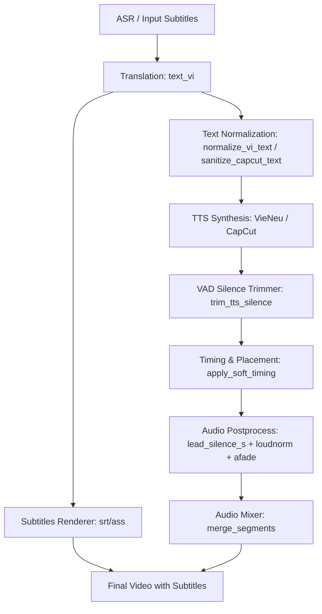

# Báo cáo Root Cause: Hiện tượng Sub hiện nhưng không đọc / Nuốt chữ (Subtitle-TTS Speech Dropping & Clipping)

- **Bug ID**: `subtitle-tts-swallow-words`
- **Ngày phân tích**: 2026-09-01
- **Mức độ nghiêm trọng**: High (Ảnh hưởng trực tiếp đến trải nghiệm nghe nhìn và tính toàn vẹn nội dung lồng tiếng)

---

## 1. Mô tả triệu chứng (Symptoms)

1. **Nuốt âm đầu / nuốt chữ đầu câu**: Phụ đề hiển thị đầy đủ (ví dụ: *"Không phải là như thế"*, *"Xin chào các bạn"*, *"Thực sự thì"*), nhưng giọng đọc bị cắt xén âm tiết đầu tiên (nghe thành *"ông phải là như thế"*, *"in chào các bạn"*, *"ực sự thì"*).
2. **Nuốt cả câu thoại (Sub hiện nhưng tiếng câm/im lặng)**: Phụ đề dòng đó vẫn xuất hiện trên màn hình đúng thời gian, nhưng không có âm thanh đọc câu thoại (hoặc chỉ có tiếng nhạc nền).
3. **Nuốt từ / đọc sót chữ bên trong câu**: Câu phụ đề chứa số, đơn vị, chữ viết tắt, ký tự đặc biệt, ngoặc đơn chú thích, hoặc ký tự Unicode tổ hợp (NFD) bị TTS bỏ qua không đọc, nuốt mất các từ chứa ký tự đó hoặc đọc ngọng/mất chữ.
4. **Nuốt chữ cuối câu (Đứt đoạn câu dài)**: Phụ đề là câu dài nhưng giọng đọc dừng giữa chừng khi chưa đọc hết các từ cuối.

---

## 2. Truy vết quy trình (Call Flow & Data Flow)



---

## 3. Các nguyên nhân gốc rễ (Root Causes)

Sau khi reverse engineer toàn bộ pipeline từ Text Normalization -> TTS Synthesis -> Audio Trimming -> Audio Postprocess -> Mixing, xác định được **4 nguyên nhân gốc rễ chính (RC-1 đến RC-4)**:

### 🔴 RC-1: Cắt tỉa khoảng lặng VAD quá nhạy và cắt lặp lại nhiều lần làm xén mất phụ âm đầu (Nuốt âm đầu câu)
- **Vị trí**:
  1. `autodub/speech/tts_trimmer.py` (`compute_speech_extents`):
     - Ngưỡng năng lượng `ENERGY_RATIO = 0.08` (8% của peak RMS) và `DEFAULT_MARGIN_S = 0.025` (chỉ 25ms đệm).
     - Trong tiếng Việt, các phụ âm vô thanh và âm bật/xát (`th`, `s`, `x`, `ph`, `kh`, `h`, `ch`, `tr`, `c/k`, `t`, `p`) có năng lượng RMS rất nhỏ (chỉ 2-4% so với đỉnh nguyên âm). Khi ngưỡng đặt 8% và margin chỉ 25ms, VAD nhận diện điểm bắt đầu trễ (sau khi phụ âm đã trôi qua và bắt đầu vào nguyên âm), dẫn tới việc cắt cụt phụ âm đầu.
  2. **Trimming lặp lại 3 lần (Double/Triple Trimming)**:
     - `vieneu_worker.py` gọi `trim_edges`.
     - `autodub/media/timing.py` (`apply_soft_timing`) gọi `trim_tts_silence(wav, wav)` đè lên file.
     - `autodub/media/audio.py` (`postprocess_voice_clip`) lại dùng `lead_silence_s` với `-ss {trim_s}` cắt thêm lần nữa!
  - **Hậu quả**: Các âm đầu như *"không"*, *"thì"*, *"sao"*, *"phải"*, *"xin"* bị gọt sạch phụ âm đầu.

---

### 🔴 RC-2: CapCut TTS gặp lỗi định dạng ký tự (TTSInvalidText) bị fallback im lặng `write_silence` (Nuốt nguyên câu)
- **Vị trí**: `autodub/speech/tts/capcut_vi.py` (hàm `synthesize` dòng 367-373):
  ```python
  except RuntimeError as e:
      if _is_invalid_text(e) or "TTSInvalidText" in str(e):
          return write_silence(output_path, duration_s=max(0.12, min(1.2, (target_duration or 0.4))))
  ```
- **Nguyên nhân**:
  - Khi câu phụ đề chứa ký tự Unicode tổ hợp (NFD), ký tự đặc biệt (`~`, `@`, `#`, `^`, `&`, `*`, `_`, `|`, `\`, `[]`, `{}`), emoji, từ tiếng Anh có ký tự lạ, hoặc câu dài vượt quá 280 ký tự, CapCut API trả về lỗi `TTSInvalidText` (hoặc error code `40402002`).
  - Thay vì làm sạch triệt để và retry với bản text chuẩn hóa an toàn, code nuốt lỗi bằng cách ghi một file WAV im lặng (`write_silence`).
  - Kết quả: Phụ đề hiển thị trên video nhưng âm thanh câm hoàn toàn.

---

### 🔴 RC-3: Chuẩn hóa chữ số và từ viết tắt chưa bao quát khiến TTS bỏ qua không đọc (Nuốt từ trong câu)
- **Vị trí**: `autodub/text/vi_numbers.py` (`normalize_vi_text`):
  - Ký tự tiền tệ, viết tắt, đơn vị ghép phổ biến trong video chưa được phiên âm:
    - Tiền tệ & số lượng: `100k` -> biến thành `một trămk` (chữ 'k' dính liền khiến TTS bỏ qua/ngắt quãng), `500k`, `200tr`, `50.000đ`, `50k/kg`, `$100`, `100$`, `100 USD`, `100 VND`.
    - Thời gian & phân số: `10h30`, `8h`, `1/2`, `3/4`, `1-2` (dấu gạch ngang bị nuốt).
    - Viết tắt công nghệ / đời sống: `AI`, `CPU`, `GPU`, `RAM`, `ROM`, `PC`, `TV`, `USB`, `OK`, `v.v.`, `v/v`, `Dr.`, `Mr.`, `No.1`, `top 1`, `1st`, `2k2`.
    - Chú thích âm thanh trong phụ đề: `(Cười)`, `[Âm nhạc]`, `(thở dài)`, `*vỗ tay*` không được xử lý phù hợp cho TTS, làm rối engine đọc.
    - Unicode NFD (Decomposed Form) chưa được chuẩn hóa thành NFC (`unicodedata.normalize('NFC', text)`), dẫn đến mất dấu thanh khi regex lọc ký tự.

---

### 🔴 RC-4: Giới hạn độ dài ngữ cảnh của Engine TTS cắt đứt đuôi câu dài (Nuốt chữ cuối câu)
- **Vị trí**: `autodub/speech/tts/capcut_vi.py` (cắt cứng tại 280 chars) và `autodub/speech/tts/vieneu_vi.py` (VieNeu v3-turbo bị tràn context khi câu > 40-50 từ).
- **Nguyên nhân**: Khi câu dịch dài ghép nhiều vế, CapCut cắt ngắn chuỗi `cleaned[:280]`, còn VieNeu bị dừng phát âm trước khi đọc hết các từ cuối. Subtitle hiển thị trọn vẹn cả câu nhưng giọng đọc dừng giữa chừng.

---

## 4. Kết luận & Đề xuất Hướng xử lý

1. **Sửa VAD Trimmer (`tts_trimmer.py` & `audio.py`)**:
   - Giảm `ENERGY_RATIO` từ `0.08` xuống `0.02` (2% peak) để bảo vệ toàn vẹn các phụ âm vô thanh / âm xát có năng lượng thấp.
   - Tăng an toàn `DEFAULT_MARGIN_S` từ `0.025` (25ms) lên `0.080` (80ms).
   - Loại bỏ cơ chế cắt lặp lại nhiều lần (chỉ trim 1 lần duy nhất tại nguồn TTS, không trim đè ở bước hậu kỳ ffmpeg nếu đã trim).
2. **Nâng cấp `normalize_vi_text` (`vi_numbers.py`)**:
   - Thêm `unicodedata.normalize('NFC', text)` đầu vào.
   - Bổ sung bộ đọc thông minh: đơn vị tiền tệ (`100k`, `500k`, `200tr`, `50k/kg`, `$`, `USD`, `VND`), thời gian (`10h30`), phân số/tỷ lệ (`1/2`, `3/4`), thứ hạng (`top 1`, `No.1`), các từ viết tắt phổ biến (`AI`, `CPU`, `RAM`, `OK`, `TV`, `PC`, `USB`, `v.v.`, `v/v`).
   - Tách/xóa các thẻ chú thích phi thoại như `[Âm nhạc]`, `(Cười)`, `*thở dài*` khỏi luồng TTS (nhưng vẫn giữ trên sub nếu cần hoặc làm sạch đồng bộ).
3. **Phòng thủ CapCut TTS & VieNeu TTS (`capcut_vi.py` & `vieneu_vi.py`)**:
   - Chuẩn hóa text siêu an toàn trước khi gọi API, không để xảy ra `TTSInvalidText`.
   - Nếu câu dài > 200 ký tự, tự động phân tách theo dấu phẩy/chấm phẩy thành các mệnh đề nhỏ rồi ghép nối âm thanh liền mạch, tuyệt đối không cắt cụt đuôi câu và không fallback im lặng.

---

`TRẠNG THÁI: CHỜ DUYỆT NGUYÊN NHÂN`
