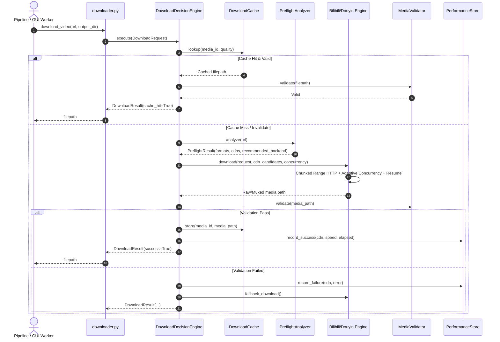

# Thiết Kế Kiến Trúc — Turbo + Reliable Smart Download Engine (Bilibili + Douyin)

- **Mã thiết kế**: `SMART-DOWNLOAD-ENGINE`
- **Thư mục triển khai**: `autodub/media/download/` và adapter tích hợp tại `autodub/media/downloader.py`

---

## 1. Sơ đồ Kiến trúc Module (Component Architecture)

```text
autodub/media/downloader.py (Public Facade & Backward Compatibility)
  │
  ▼
autodub/media/download/
  ├── contract.py               # DownloadResult, DownloadRequest, PreflightResult, ErrorType
  ├── validator.py              # MediaValidator (ffprobe container/stream integrity check)
  ├── retry.py                  # ErrorClassifier, SmartRetryPolicy (exponential backoff + jitter)
  ├── partial_manager.py        # Resume & Partial state (.progress.json, Range HTTP handling)
  ├── concurrency.py            # AdaptiveConcurrencyController (AIMD throughput-based scaling)
  ├── session_manager.py        # Cookie & SessionManager (Chrome/Edge/saved sessions)
  ├── browser_pool.py           # BrowserPool (Playwright Chromium lifecycle, pool of contexts)
  ├── preflight.py              # PreflightAnalyzer & CDN Racing Engine (TTFB/Range probe)
  ├── cdn_racer.py              # Lightweight multi-CDN latency/bandwidth ranking
  ├── cache.py                  # DownloadCache (integrated with Universal Pipeline Cache SQLite)
  ├── performance_store.py      # Telemetry & CDN Health Score database (SQLite)
  ├── bilibili_engine.py        # BilibiliDownloader (DASH chunked streams + Progressive HTTP)
  ├── douyin_engine.py          # DouyinDownloader (Direct media -> Cached candidate -> BrowserPool)
  └── decision_engine.py        # DownloadDecisionEngine (Orchestrator choosing best backend & CDN)
```

---

## 2. Luồng Xử Lý Chi Tiết (Execution Flow)



---

## 3. Chi Tiết Từng Thành Phần

### 3.1 `MediaValidator` (`autodub/media/download/validator.py`)
- Thực thi `ffprobe` với các flags: `-v error -show_entries format=duration,size,format_name:stream=codec_type,codec_name,width,height,r_frame_rate -of json`.
- Kiểm tra các tiêu chuẩn vàng:
  1. File size $\ge 10$ KB.
  2. Thời lượng `duration > 0.1` giây.
  3. Có ít nhất một `stream` với `codec_type == "video"`, `width > 0`, `height > 0`.
  4. Nếu video không phải mute: kiểm tra stream `codec_type == "audio"`.
  5. Đọc được moov atom mà không có lỗi container truncated.

### 3.2 `AdaptiveConcurrencyController` (`autodub/media/download/concurrency.py`)
- Sử dụng thuật toán AIMD (Additive Increase / Multiplicative Decrease):
  - Khởi điểm: `workers = 4`.
  - Giới hạn: `min_workers = 1`, `max_workers = 8`.
  - Khi throughput tăng và không có lỗi trong khoảng 3 chunk liên tiếp: `workers = min(max_workers, workers + 1)`.
  - Khi phát hiện HTTP 429, timeout, hoặc connection reset: `workers = max(min_workers, workers // 2)`, kích hoạt cooldown 3-5 giây.

### 3.3 `BrowserPool` (`autodub/media/download/browser_pool.py`)
- Singleton pattern bảo vệ bằng `threading.Lock`.
- Khởi tạo tiến trình Chromium duy nhất với các flags chống bot: `--disable-blink-features=AutomationControlled`, `--no-sandbox`.
- Phương thức `acquire_context()`: tạo browser context mới với clean session hoặc reuse cookie.
- Phương thức `release_context(context)`: đóng context an toàn và giải phóng bộ nhớ.
- `shutdown()`: dọn dẹp sạch tiến trình khi ứng dụng thoát hoặc nhận tín hiệu terminate.

### 3.4 `BilibiliDownloader` (`autodub/media/download/bilibili_engine.py`)
- Bóc tách BV / av code và p-index.
- Phân tích streams:
  - Nếu có DASH: tách luồng video (HEVC/AV1) và audio riêng biệt, tải đồng thời qua chunked HTTP Range request với Adaptive Concurrency.
  - Tự động race giữa các CDN host (`upos-sz-mirrorali.bilivideo.com`, `upos-sz-mirrorcos.bilivideo.com`, `upos-sz-mirrorhw.bilivideo.com`, `akamaized.net`).
  - Mux video + audio thành file MP4 hoàn chỉnh bằng FFmpeg `-c copy`.
  - Tự động fallback sang yt-dlp native nếu API Bilibili đòi chữ ký WBI phức tạp mà chưa giải mã được.

### 3.5 `DouyinDownloader` (`autodub/media/download/douyin_engine.py`)
- Bóc tách video ID từ mọi định dạng link (v.douyin.com, douyin.com/video, modal_id).
- Chiến lược phân tầng:
  1. Direct Play URL không watermark qua mobile API / share page JSON regex (nhanh nhất, 0 overhead).
  2. Direct CDN stream sniffing qua `BrowserPool` (Chromium dùng chung).
  3. Mux DASH video + audio nếu là luồng DASH, hoặc lưu stream trực tiếp nếu là Progressive MP4.

### 3.6 `DownloadDecisionEngine` (`autodub/media/download/decision_engine.py`)
- Điều phối trung tâm: nhận `DownloadRequest`, gọi `PreflightAnalyzer`, kiểm tra `DownloadCache`, chọn backend và CDN thích hợp nhất, khởi chạy tải có giám sát và xác thực qua `MediaValidator`.
- Ghi nhận telemetry vào `PerformanceStore` để cải thiện chỉ số tin cậy (Health Score) của từng CDN.
