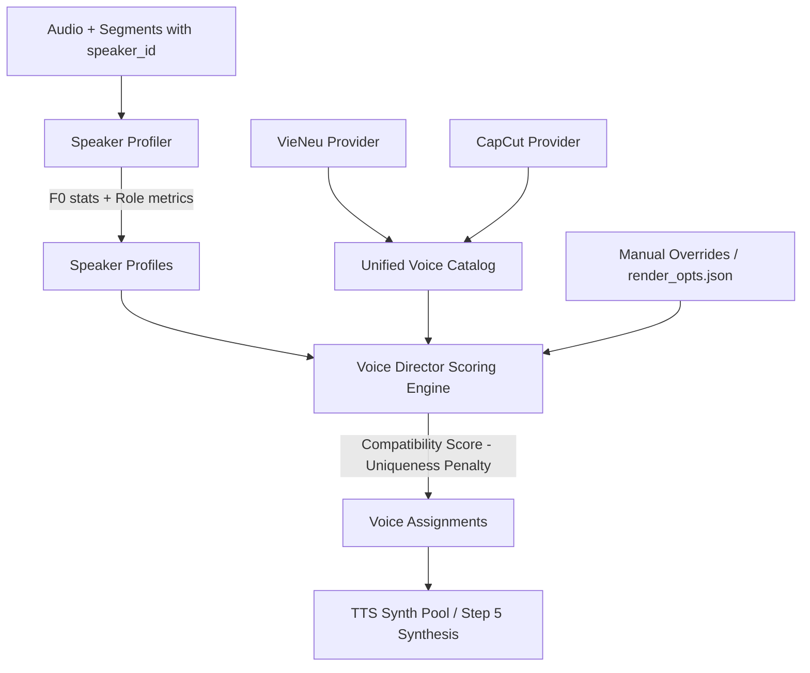

# Thiết kế Kiến trúc — AI Multi-Speaker Smart Voice Director

## 1. Tổng quan kiến trúc

Hệ thống **AI Multi-Speaker Smart Voice Director** bổ sung tầng phân tích đặc trưng người nói (Speaker Profiler), tầng trừu tượng hoá nguồn giọng (Unified Voice Catalog & Providers cho VieNeu và CapCut), và động cơ chấm điểm phân vai thông minh (Voice Director Engine).



---

## 2. Các Module & API Contract

### Module 1: `autodub/speech/voice_models.py`
Chứa các dataclass bất biến (dataclasses) định nghĩa dữ liệu trung chuyển:

```python
@dataclass(frozen=True)
class PitchStats:
    pitch_median: float          # Hz trung vị
    pitch_p10: float             # phân vị 10%
    pitch_p90: float             # phân vị 90%
    pitch_std: float             # độ lệch chuẩn cao độ
    voiced_ratio: float          # tỷ lệ frame có tiếng / tổng frame (0..1)
    confidence: float            # độ tin cậy của ước lượng F0 (0..1)

@dataclass
class SpeakerProfile:
    speaker_id: int
    gender: str                  # "male" | "female" | "unknown"
    gender_confidence: float     # 0.0 .. 1.0
    pitch_stats: PitchStats
    role: str                    # "narrator" | "character" | "unknown"
    role_confidence: float       # 0.0 .. 1.0
    total_duration_s: float
    segment_count: int
    timeline_coverage: float     # (last_end - first_start) / total_audio_dur
    avg_segment_duration_s: float

@dataclass(frozen=True)
class VoiceProfile:
    voice_id: str
    name: str
    provider: str                # "vieneu" | "capcut"
    gender: str                  # "male" | "female" | ""
    region: str                  # "bac" | "trung" | "nam" | ""
    style: str                   # "tu_nhien" | "tin_tuc" | "doc_truyen"
    narrator_suitability: float  # 0.0 .. 1.0
    pitch_tag: str               # "deep_male" | "young_male" | "female" | "child_or_high" | ""

@dataclass
class VoiceAssignment:
    speaker_id: int
    voice_id: str
    source: str                  # "auto" | "manual_override" | "fallback"
    score: float
    reason: str

@dataclass
class CastingResult:
    assignments: dict[int, VoiceAssignment]
    profiles: dict[int, SpeakerProfile]
    director_enabled: bool
```

---

### Module 2: `autodub/speech/speaker_profiler.py`
Trích xuất $F_0$ và tính toán các chỉ số thống kê trên CPU (`numpy` + `scipy.signal`):

1. **Ngưỡng cấu hình:**
   ```python
   DEFAULT_DEEP_MALE_MAX_HZ = 135.0
   DEFAULT_YOUNG_MALE_MAX_HZ = 175.0
   DEFAULT_FEMALE_MAX_HZ = 255.0
   MIN_VOICED_FRAMES = 5
   ```
2. **Thuật toán ước lượng $F_0$:**
   - Cắt các đoạn audio tương ứng với từng `speaker_id` (ghép các segment).
   - Chia frame 30ms với bước nhảy 10ms (hop 10ms), áp dụng hàm cửa sổ Hanning.
   - Tính tự tương quan (Normalized Autocorrelation) trong dải tần số $60\text{ Hz} \le F_0 \le 400\text{ Hz}$.
   - Trả về `PitchStats(pitch_median, pitch_p10, pitch_p90, pitch_std, voiced_ratio, confidence)`.
3. **Phân loại Giới tính (Probabilistic):**
   - Không kết luận tuyệt đối; tính xác suất `gender_confidence`:
     - Nếu $F_0 < 150\text{ Hz} \rightarrow \text{male}$ với confidence tăng dần khi $F_0$ càng thấp.
     - Nếu $F_0 > 175\text{ Hz} \rightarrow \text{female}$ với confidence tăng dần khi $F_0$ càng cao.
     - Vùng $150-175\text{ Hz} \rightarrow$ confidence thấp ($< 0.65$), đánh dấu `unknown` nếu không đủ mẫu.
4. **Phân loại Vai trò Dẫn chuyện (Narrator Role Detection):**
   - Độc lập với giới tính:
     - `is_narrator = (total_duration_s / total_audio_dur >= 0.35) and (timeline_coverage >= 0.60) and (segment_count >= 4)`
     - Gán `role = "narrator"`, `role_confidence = 0.85`.

---

### Module 3: `autodub/speech/voice_catalog.py` & Providers
Cung cấp abstraction chung cho các nguồn giọng:

```python
class VoiceProvider(Protocol):
    def get_voices(self) -> list[VoiceProfile]: ...
    def is_available(self) -> bool: ...

class VieNeuVoiceProvider:
    # Nạp từ autodub.speech.tts.voices (VieNeu offline)
    
class CapCutVoiceProvider:
    # Nạp từ autodub.speech.tts.voices (CapCut online)

class UnifiedVoiceCatalog:
    # Quản lý danh sách voice profile hợp nhất, lọc theo provider và thuộc tính
```

---

### Module 4: `autodub/speech/voice_director.py`
Engine chấm điểm và phân vai tự động:

1. **Ma trận tương thích (Compatibility Scoring):**
   $$\text{Score} = w_g \cdot S_{\text{gender}} + w_p \cdot S_{\text{pitch}} + w_n \cdot S_{\text{narrator}} + w_a \cdot S_{\text{provider}} - P_{\text{unique}}$$
   - $w_g = 0.40$ (Khớp giới tính).
   - $w_p = 0.20$ (Khớp cao độ).
   - $w_n = 0.25$ (Khớp phong cách dẫn chuyện nếu là narrator).
   - $w_a = 0.15$ (Ưu tiên provider hiện tại của dự án).
   - $P_{\text{unique}} = 0.80$ (Phạt nặng nếu giọng đó đã được gán cho một speaker khác trước đó).
2. **Xử lý Manual Override:**
   - Nếu `manual_overrides[speaker_id]` có giá trị $\rightarrow$ Giữ nguyên gán giọng với `source="manual_override"`, đánh dấu voice này là `used` và AI Director phân vai cho các speaker còn lại.
3. **Toggle Bật/Tắt:**
   - Khi `auto_voice_director_enabled=False` $\rightarrow$ gán tất cả `speaker_id` về `current_voice` với `source="fallback"`.

---

## 3. Quy trình tích hợp Pipeline (`autodub/pipeline.py`)

1. **Step 3.6 (Diarization):** Gán `speaker_id` cho các câu thoại.
2. **Step 3.7 (Auto Voice Casting):**
   ```python
   if settings.auto_voice_director_enabled and len(spk_set) > 1:
       profiles = profile_speakers(audio_path, segments, settings)
       casting = cast_voices(profiles, catalog, current_voice=req.voice,
                             manual_overrides=render_opts.get("speaker_voices"))
       speaker_voices = {spk_id: va.voice_id for spk_id, va in casting.assignments.items()}
       render_opts["speaker_voices"] = speaker_voices
       render_opts["speaker_profiles"] = {k: asdict(v) for k, v in profiles.items()}
   ```
3. **Step 5 (TTS Synthesis):**
   - `_synthesize_segments` đọc `speaker_voices` và tự động dispatch câu thoại đến đúng bộ tổng hợp giọng.

---

## 4. Giao diện Người dùng (GUI)

- Trong Tab **Giọng đọc** (`editor_panels.py`):
  - Checkbox **[x] Tự động phân vai AI (Auto Voice Director)**.
  - Khung **Nhân vật trong video**:
    - Hiển thị từng hàng: Avatar giới tính, Tên (`Speaker 0 - Dẫn chuyện`), Thời lượng (`15 câu · 45s`), Dropdown Voice (VieNeu / CapCut) + Nút Nghe thử.
    - Khi người dùng đổi giọng trên dropdown $\rightarrow$ lưu `manual_override`.
    - Nút **[Khôi phục phân vai AI]** $\rightarrow$ xoá manual override và chạy lại auto-casting.

---

## 5. Kế hoạch Kiểm thử & Benchmark (Verification & Benchmark Plan)

### A. Benchmark Hiệu năng ($F_0$ Profiler)
- Script: `tests/benchmark_speaker_profiler.py`
- Môi trường: CPU only (`os.environ["CUDA_VISIBLE_DEVICES"] = ""`).
- Mẫu kiểm thử: Audio 60s, 180s, 300s với 3 speaker xen kẽ.
- Thực hiện 10 lần lặp sau 1 lần warm-up.
- **Tiêu chí nghiệm thu:**
  - $\text{Median Time} < 500\text{ ms}$ cho audio 5 phút.
  - $\text{P95 Time} < 750\text{ ms}$.
  - GPU Utilization $= 0\%$.

### B. Unit & Property Tests
1. `tests/test_speaker_profiler.py`:
   - Kiểm tra F0 trên sóng sine 120Hz (deep male), 155Hz (young male), 210Hz (female), 300Hz (child).
   - Kiểm tra đoạn audio im lặng hoàn toàn (voiced_ratio = 0, confidence = 0).
   - Kiểm tra đoạn audio ngắn ($<0.5\text{s}$).
2. `tests/test_voice_director.py`:
   - Kiểm tra Uniqueness: 3 speaker được gán 3 giọng khác nhau.
   - Kiểm tra Manual Override: Không ghi đè speaker đã bị user khóa.
   - Kiểm tra Toggle: Khi disable, toàn bộ speaker nhận 1 giọng.
   - Kiểm tra kho giọng VieNeu & CapCut.
3. `tests/test_pipeline_multi_voice.py`:
   - Tích hợp Step 3.6 $\rightarrow$ Step 3.7 $\rightarrow$ Step 5 đa giọng end-to-end.
