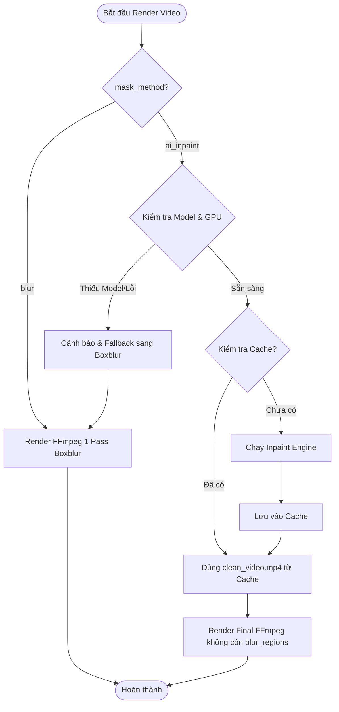

# Thiết kế Kiến trúc: AI Subtitle Remover Integration (Phương thức che/xóa phụ đề thứ 2)

> Feature: `ai-subtitle-remover`. Nguồn: Requirement đã duyệt `.artifacts/requirements/ai-subtitle-remover-integration.md`. Skill: `architecture-design`.

---

## 1. Requirement đã duyệt

- Bổ sung **Phương thức thứ 2: AI Inpainting** (xóa sạch phụ đề, tái tạo nền tự nhiên) song song với **Phương thức 1: FFmpeg Boxblur** hiện tại.
- Hỗ trợ kiến trúc **Hybrid**:
  - **Embedded Engine (LaMa ONNX):** Tích hợp sẵn engine inpainting nhẹ (~200MB model ONNX), chạy tối ưu trên GPU (CUDA/DirectML) lẫn CPU, không xung đột dependency.
  - **VSR Bridge Adapter:** Cho phép kết nối trực tiếp với bản cài đặt độc lập của `video-subtitle-remover` (VSR) nếu người dùng muốn dùng các mô hình nâng cao như STTN/ProPainter.
- Cơ chế **Smart Inpaint Caching**: Tái sử dụng video sạch đã inpaint nếu thông số video nguồn và vùng ROI không đổi.
- **Graceful Fallback**: Tự động fallback về Boxblur và báo warning nếu môi trường GPU/Model không sẵn sàng.

---

## 2. Kiến trúc hiện tại liên quan

- `autodub/media/subtitle.py`:
  - `build_filter_complex(...)`: Nhận `blur_regions` và tạo chuỗi ffmpeg filter `crop=...boxblur=...overlay=...`.
- `autodub/media/video.py`:
  - `render_final_video(...)`: Gọi `build_filter_complex` và encode 1 lượt video final.
- `autodub/pipeline.py`:
  - Điều phối toàn bộ quy trình: Tách audio ➔ Transcribe ➔ Dịch ➔ TTS ➔ Align ➔ Render Final Video.
- `autodub/editor.py`:
  - Quản lý `EditorState`, `render_opts` (bao gồm `blur_regions`, `subtitle_style`, `video_speed`).
- `autodub/preflight.py`:
  - Kiểm tra môi trường hệ thống (FFmpeg, CUDA, v.v.).

---

## 3. Kiến trúc đề xuất

Hệ thống được thiết kế theo mô hình **Pipeline Pre-Processing Pattern**:

```
                         ┌─────────────────────────────────────────────────┐
                         │              Input Video + ROI Coords           │
                         └───────────────────────┬─────────────────────────┘
                                                 │
                                     [ mask_method == ? ]
                                    ╱                    ╲
                     "ai_inpaint"  ╱                      ╲  "blur" (Mặc định)
                                  ▼                        ▼
                   ┌──────────────────────────────┐        │
                   │   Inpaint Cache Lookup       │        │
                   │ (SHA256 video + ROI + model) │        │
                   └──────────────┬───────────────┘        │
                            Hit   │   Miss                 │
                     ┌────────────┴───────────┐            │
                     ▼                        ▼            │
             [ Lấy từ Cache ]      ┌────────────────────┐  │
                     │             │  InpaintEngine     │  │
                     │             │ (LaMa ONNX / VSR)  │  │
                     │             └──────────┬─────────┘  │
                     │                        │            │
                     └────────────┬───────────┘            │
                                  ▼                        │
                         [ clean_video.mp4 ]               │
                                  │                        │
                                  ▼                        ▼
                   ┌──────────────────────────────────────────────┐
                   │           Final FFmpeg Filtergraph           │
                   │  - Retime / Speed / Aspect Ratio             │
                   │  - Smart Flip / Anti-ID Filters              │
                   │  - Burn-in Vietsub mới (nếu có)              │
                   │  - (Nếu là blur: kèm crop+boxblur+overlay)   │
                   └──────────────────────┬───────────────────────┘
                                          ▼
                               [ Final Rendered Video ]
```

---

## 4. Component thay đổi / Thêm mới

### 4.1. Module mới `autodub/media/inpaint/`
1. `autodub/media/inpaint/__init__.py`: Export `get_inpaint_engine`, `inpaint_video_with_cache`.
2. `autodub/media/inpaint/base.py`: Abstract Base Class `BaseInpaintEngine` định nghĩa interface chung:
   - `inpaint_frame(frame_bgr, mask_uint8) -> frame_bgr`
   - `inpaint_video(input_path, output_path, regions, progress_cb) -> str`
3. `autodub/media/inpaint/lama_onnx.py`:
   - Engine LaMa ONNX (`LaMaOnnxEngine`): Load model ONNX Runtime, tự động chọn Execution Provider (`CUDAExecutionProvider`, `DmlExecutionProvider`, `CPUExecutionProvider`).
   - Xử lý mask từ danh sách `blur_regions` (0..1 coordinates) hoặc mask ảnh.
   - Stream frame qua FFmpeg pipe đọc/ghi để tiết kiệm RAM.
4. `autodub/media/inpaint/vsr_bridge.py`:
   - Adapter `VSRBridgeEngine`: Gọi subprocess `video-subtitle-remover` CLI (`backend/main.py`).
5. `autodub/media/inpaint/cache.py`:
   - `get_inpaint_cache_path(video_path, regions, model_name, cache_dir) -> str`
   - Quản lý metadata cache (hash file, kích thước, thời gian).

### 4.2. Component sửa đổi
1. `autodub/config.py`:
   - Thêm các cấu hình mặc định:
     - `mask_method`: `"blur"` | `"ai_inpaint"` | `"none"`
     - `inpaint_engine`: `"lama_onnx"` | `"vsr_cli"`
     - `inpaint_device`: `"auto"` | `"cuda"` | `"directml"` | `"cpu"`
     - `inpaint_model_path`: Đường dẫn file `.onnx` (mặc định trong `models/inpaint/lama.onnx`)
     - `vsr_dir`: Đường dẫn thư mục cài VSR ngoài (nếu dùng VSR Bridge)
2. `autodub/media/video.py`:
   - Cập nhật hàm `render_final_video`: Tiếp nhận `mask_method`. Nếu là `"ai_inpaint"`, gọi `inpaint_video_with_cache` trước, sau đó truyền `clean_video.mp4` và danh sách `blur_regions=[]` vào `build_filter_complex`.
3. `autodub/pipeline.py`:
   - Tích hợp bước inpaint vào pipeline chính (Step tiền xử lý video), có log `[AI-INPAINT]` và cập nhật progress.
4. `autodub/preflight.py`:
   - Hàm `check_inpaint_capability()`: Kiểm tra ONNX Runtime, CUDA/DirectML và sự tồn tại của file model.
5. `autodub/editor.py`:
   - Lưu `mask_method` trong `EditorState` và `project.json`.

---

## 5. Data Flow

1. **Input:** Người dùng tải video vào dự án và định nghĩa các vùng `blur_regions` (hoặc bật auto).
2. **Lựa chọn:** Người dùng chọn `mask_method = "ai_inpaint"` (Phương thức 2).
3. **Cache Hash Calculation:**
   $$\text{Key} = \text{SHA256}(\text{video\_file\_hash} + \text{regions\_json} + \text{model\_name})$$
4. **Processing (nếu Cache Miss):**
   - Mở FFmpeg pipe đọc từng khung hình video nguồn dưới dạng Raw BGR24.
   - Sinh ma trận Mask nhị phân (1 ở vùng `blur_regions`, 0 ở vùng còn lại).
   - Feed qua `LaMaOnnxEngine` theo batch (mặc định 4-8 frames/batch tùy VRAM).
   - Ghi các frame đã inpaint vào FFmpeg pipe encoder (x264 CRF 17).
   - Lưu video vào `.cache/inpaint/<Key>.mp4`.
5. **Final Compose:** FFmpeg nhận `.cache/inpaint/<Key>.mp4` làm input video, ghép audio tiếng Việt và ghi đè phụ đề vietsub mới.

---

## 6. Control Flow & Error Handling



---

## 7. Database / Metadata

Trong file `project.json` / `EditorState`:
```json
{
  "render_opts": {
    "mask_method": "ai_inpaint",
    "inpaint_engine": "lama_onnx",
    "inpaint_device": "auto",
    "blur_regions": [
      {"x": 0.1, "y": 0.85, "w": 0.8, "h": 0.12, "t_start": null, "t_end": null}
    ]
  }
}
```

---

## 8. API Contract (`autodub/media/inpaint/`)

```python
class BaseInpaintEngine(ABC):
    @abstractmethod
    def inpaint_video(
        self,
        video_path: str,
        output_path: str,
        regions: list[dict],
        device: str = "auto",
        progress_cb: Callable[[float, str], None] | None = None,
        cancel_event: threading.Event | None = None,
    ) -> str:
        """Thực hiện xóa phụ đề trên video và ghi ra output_path."""
        pass

def inpaint_video_with_cache(
    video_path: str,
    regions: list[dict],
    cache_dir: str | None = None,
    engine_type: str = "lama_onnx",
    device: str = "auto",
    model_path: str | None = None,
    progress_cb: Callable[[float, str], None] | None = None,
    cancel_event: threading.Event | None = None,
) -> str:
    """Wrapper quản lý cache: trả về đường dẫn clean_video.mp4."""
```

---

## 9. UI Contract

- Trong trang **Cài đặt (Settings)**:
  - Mục `Phương thức che phụ đề gốc`:
    - `(o) Làm mờ Boxblur (Mặc định - Nhanh)`
    - `( ) Xóa sạch bằng AI Inpainting (Chất lượng cao)`
  - Dropdown chọn Thiết bị (`Tự động`, `NVIDIA CUDA`, `DirectML`, `CPU`).
- Trong **Hộp thoại Xuất video (Export Dialog)**:
  - Cho phép chuyển đổi nhanh giữa `Làm mờ` và `Xóa AI`.

---

## 10. Validation & Edge Cases

1. **Vùng ROI rỗng (`blur_regions = []`):**
   - Nếu `mask_method == "ai_inpaint"` nhưng không có vùng ROI nào được chọn, bỏ qua inpaint (không tốn thời gian vô ích).
2. **Kích thước video không chia hết cho 8 (ONNX Padding):**
   - Model LaMa yêu cầu kích thước chia hết cho 8. Engine tự động pad thêm viền đối xứng (reflection padding) trước khi feed vào model và crop lại đúng kích thước gốc.
3. **Cancelation giữa chừng:**
   - Nếu user bấm Hủy, ngắt FFmpeg sub-processes, dọn dẹp file tạm `.temp_inpaint_*.mp4`, giải phóng GPU memory.

---

## 11. Security & Privacy

- 100% xử lý hoàn toàn Offline trên máy cục bộ của người dùng.
- Không tải hay gửi bất kỳ frame hình ảnh nào ra ngoài internet.

---

## 12. Performance & VRAM Optimization

- **Batch Size:** Tự động điều chỉnh theo độ phân giải:
  - $\le 720p$: Batch 8 frames.
  - $1080p$: Batch 4 frames.
  - $4K$: Batch 1-2 frames hoặc crop chỉ inpaint vùng ROI bounding-box thay vì toàn bộ khung hình 4K (Tăng tốc gấp 3-5 lần).
- **Streaming Pipes:** Không nạp toàn bộ video vào RAM. Đọc/ghi tuần tự qua stdin/stdout của FFmpeg.

---

## 13. Testing Strategy

1. `tests/test_inpaint_cache.py`:
   - Test hàm sinh hash cache: Đảm bảo cùng input + cùng ROI ➔ cùng hash; đổi ROI ➔ khác hash.
2. `tests/test_inpaint_engine.py`:
   - Mock ONNX Runtime session để test luồng `inpaint_video`, test padding/unpadding, test progress callback và cancel event.
3. `tests/test_video_render_inpaint.py`:
   - Test tích hợp `render_final_video` với `mask_method="blur"` và `mask_method="ai_inpaint"`.

---

## 14. File dự kiến thay đổi

### File thêm mới:
- `autodub/media/inpaint/__init__.py`
- `autodub/media/inpaint/base.py`
- `autodub/media/inpaint/lama_onnx.py`
- `autodub/media/inpaint/vsr_bridge.py`
- `autodub/media/inpaint/cache.py`
- `tests/test_inpaint_cache.py`
- `tests/test_inpaint_engine.py`

### File sửa đổi:
- `autodub/config.py`
- `autodub/media/video.py`
- `autodub/pipeline.py`
- `autodub/preflight.py`
- `autodub/editor.py`

---

## 15. File không được tự ý thay đổi

- `autodub/speech/*` (TTS, ASR, Voice Sync không bị ảnh hưởng).
- `autodub/text/*` (Dịch thuật, SRT formatting không bị ảnh hưởng).
- `autodub/media/retime.py` (Thuật toán đồng bộ nhịp giữ nguyên).

---

## 16. Quyết định thiết kế (Design Decisions)

| Quyết định | Lý do |
| :--- | :--- |
| **Dùng LaMa ONNX làm Engine mặc định** | LaMa Inpainting cho chất lượng xóa chữ tốt nhất cho khung hình đơn lẻ và background, ONNX Runtime nhẹ, đa nền tảng, không kéo theo 4GB dependency như trọn bộ Paddle. |
| **Kiến trúc 2-Stage (Pre-process Inpaint ➔ Final Compose)** | Giữ cho filtergraph FFmpeg đơn giản, độc lập và cho phép cache lại video sạch để dùng nhiều lần. |
| **Inpaint theo ROI Bounding-Box Crop** | Chỉ crop vùng có phụ đề đưa vào AI xử lý rồi dán lại vào khung hình lớn, giúp giảm 70-80% thời gian tính toán và tránh tràn VRAM trên video 2K/4K. |

---

## Approval Gate

`TRẠNG THÁI: CHỜ DUYỆT THIẾT KẾ`
