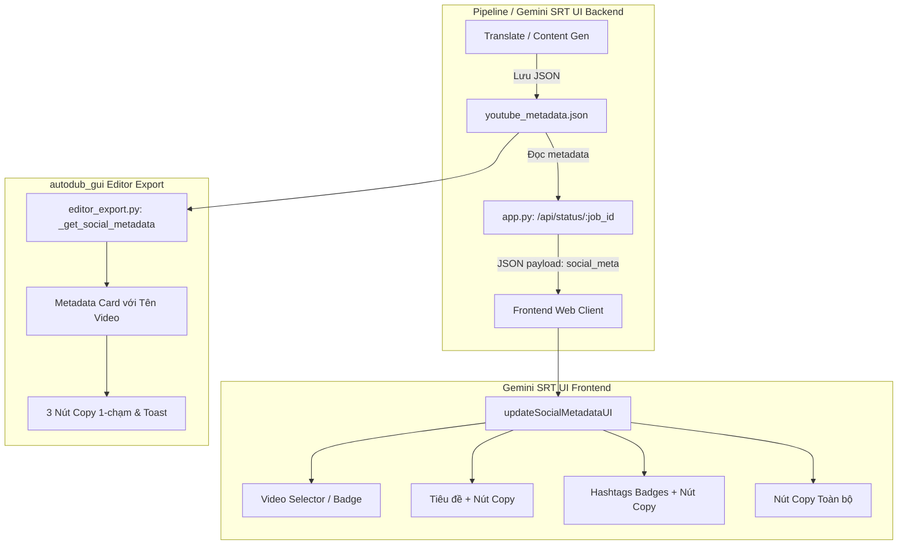

# Thiết kế kiến trúc: Hiển thị Tiêu đề & Hashtags trên Giao diện Tool kèm Nút Sao chép và Phân biệt Video

- **Feature**: `metadata-title-hashtags-ui`
- **Ngày thiết kế**: 2026-09-01
- **Dựa trên**: Requirement Analysis tại [.artifacts/requirements/metadata-title-hashtags-ui.md](file:///d:/Project/lphvsub-main/.artifacts/requirements/metadata-title-hashtags-ui.md)

---

## 1. Requirement đã duyệt

- Hiển thị trực quan Tiêu đề (Title) và Hashtags ngay trên giao diện Tool (cả Web UI `gemini_srt_ui` và Desktop GUI `autodub_gui`).
- Cung cấp nút sao chép 1-chạm (`Copy Title`, `Copy Hashtags`, `Copy All`).
- Phân biệt rõ ràng theo từng video (tên video / ID) khi chạy 1 video hoặc chạy hàng loạt (Batch).

---

## 2. Kiến trúc hiện tại liên quan

- `autodub/content/generator.py`: Sinh `youtube_metadata.json` chứa `{"title": "...", "description": "...", "hashtags": [...], "tiktok": {...}, "facebook": {...}}`.
- `autodub/pipeline.py`: Trích xuất metadata từ bản dịch AI Studio và lưu vào `youtube_metadata.json` & `youtube_post.txt`.
- `autodub/tools/gemini_srt_ui/app.py`: Backend Flask phục vụ giao diện web dịch SRT / Video.
- `autodub/tools/gemini_srt_ui/static/index.html`: Giao diện Web SPA gồm Live Subtitle Table, API Key Pool, Batch File List.
- `autodub_gui/pages/editor_export.py`: Trang Xuất bản & Hậu kỳ video trong ứng dụng Desktop PySide6.

---

## 3. Kiến trúc đề xuất



---

## 4. Chi tiết Component thay đổi

### Component 1: Web Backend API (`autodub/tools/gemini_srt_ui/app.py`)
- Mở rộng hàm `/api/status/<job_id>`:
  - Khi job hoàn tất (hoặc có bản dịch mang metadata): tự động đọc `youtube_metadata.json` hoặc trích xuất `title`, `hashtags`, `description` từ kết quả.
  - Trả về trường `social_metadata`:
    ```json
    {
      "filename": "video_tap_1.mp4",
      "title": "Tóm Tắt Phim Siêu Cuốn 2026",
      "description": "Nội dung phim...",
      "hashtags": ["#reviewphim", "#phimhay", "#shorts", "#trending"],
      "hashtags_str": "#reviewphim #phimhay #shorts #trending",
      "full_text": "Tiêu đề: Tóm Tắt Phim Siêu Cuốn 2026\n\n#reviewphim #phimhay #shorts #trending"
    }
    ```

### Component 2: Web UI (`autodub/tools/gemini_srt_ui/static/index.html`)
- Thêm Card **"🏷️ Tiêu đề & Hashtags Mạng Xã Hội"** ngay dưới hoặc cạnh Bảng Phụ đề:
  - Header: Hiển thị icon `🎬 Video: <filename>`.
  - Body:
    - Box Tiêu đề: typography to rõ, nút `📋 Sao chép Tiêu đề`.
    - Box Hashtags: Các pill badge gradient đẹp mắt, nút `🏷️ Sao chép Hashtags`.
    - Action bar: `📄 Sao chép Toàn bộ`.
  - Hỗ trợ chuyển đổi nhanh qua tabs/dropdown nếu có nhiều file trong hàng loạt.
  - Hàm JavaScript:
    - `copyToClipboard(text, btnElement)`: sử dụng `navigator.clipboard.writeText` kèm fallback `document.execCommand('copy')`.
    - Khi click: Nút chuyển sang nền xanh lá + `✓ Đã chép!` trong 1.5 giây.

### Component 3: Desktop GUI (`autodub_gui/pages/editor_export.py`)
- Cập nhật Card Metadata trên giao diện Xuất bản:
  - Hiển thị rõ tên video nguồn đang xử lý.
  - Thêm hàng nút thao tác nhanh:
    - Nút `📋 Tiêu đề`
    - Nút `🏷️ Hashtags`
    - Nút `📄 Toàn bộ`
  - Hiển thị danh sách hashtags dạng Pill Badges trực quan.

---

## 5. UI Contract (Visual Design Tokens)

- **Style Theme**: Glassmorphism Dark Mode ăn khớp với hệ thống design hiện tại của `lphvsub`.
- **Hashtag Badge**:
  - `background: rgba(99, 102, 241, 0.15); border: 1px solid rgba(99, 102, 241, 0.3); color: #818cf8; border-radius: 6px; padding: 3px 8px; font-size: 12px; font-weight: 500;`
- **Copy Button (Normal)**:
  - `background: var(--surface2); border: 1px solid var(--border); color: var(--text1); padding: 5px 12px; border-radius: 6px; cursor: pointer; transition: all 0.2s;`
- **Copy Button (Success)**:
  - `background: #059669; border-color: #10b981; color: white;`

---

## 6. Kế hoạch Kiểm thử (Test Plan)

1. **Backend Tests**:
   - `tests/test_gemini_srt_social_metadata.py`: Kiểm tra endpoint `/api/status/<job_id>` trả về đúng cấu trúc `social_metadata` cho cả file đơn lẻ và batch.
2. **Frontend UI Tests**:
   - Kiểm tra hiển thị đúng tên video, tiêu đề, danh sách hashtags.
   - Kiểm tra hàm sao chép clipboard hoạt động mượt mà không lỗi.
3. **Desktop GUI Tests**:
   - `tests/test_editor_export_metadata_ui.py`: Kiểm tra nút sao chép và hiển thị thẻ metadata trong `editor_export.py`.

---

## 7. Rủi ro & Biện pháp phòng ngừa

- **Rủi ro trình duyệt chặn Clipboard API**: Có sẵn fallback `document.execCommand('copy')` bằng textarea ẩn để chạy được trên mọi trình duyệt/kết nối HTTP cục bộ.
- **Rủi ro video không có metadata**: Giao diện ẩn khối hoặc hiển thị placeholder thân thiện, không báo lỗi.

---

`TRẠNG THÁI: CHỜ DUYỆT THIẾT KẾ`
