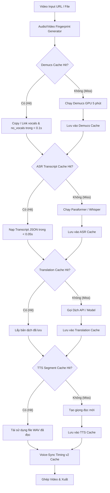

# Thiết kế Kiến trúc: Universal Pipeline Cache (UPC) — Bộ nhớ đệm liên dự án

## 1. Requirement đã duyệt
- Khi người dùng chạy lại cùng một video (hoặc tạo dự án mới từ cùng một link video/file âm thanh), các công đoạn nặng đã từng xử lý **không được chạy lại**:
  1. Tách nhạc nền & lời thoại AI (Demucs) — không chạy lại 5 phút GPU.
  2. Quét VAD & nhận diện giọng nói (ASR: Paraformer / Whisper) — không chạy lại 4–10 phút CPU/GPU.
  3. Dịch tự động (LLM / Cloud API) — không gọi lại API, không tốn quota và thời gian dịch lại các câu đã dịch.
  4. Tạo giọng đọc TTS — tái sử dụng các câu thoại cùng giọng đọc và nội dung.
- Các bài kiểm thử hiện có (77/77 tests) phải tiếp tục PASS.
- Cache phải deterministic, an toàn đa luồng (thread-safe), chống race-condition và có cơ chế vô hiệu hóa (invalidation) khi file nguồn bị thay đổi.

---

## 2. Kiến trúc hiện tại liên quan
Trong `autodub/pipeline.py`, các bước xử lý hiện tại chỉ kiểm tra file cục bộ trong thư mục `work_dir` (`data_dir(work_dir)`):
* `STEP 2`: Kiểm tra `data/original_audio.wav`.
* `STEP 2.5`: Kiểm tra `data/vocals.wav` và `data/no_vocals.wav`.
* `STEP 3`: Kiểm tra `data/transcript_original.json`.
* `STEP 4`: Kiểm tra `data/transcript_vietnamese.json`.
* `STEP 5`: Kiểm tra `data/segments/<id>.wav`.
* `STEP 6`: Đã có persistent cache v2 trong `autodub/speech/align.py`.

**Điểm nghẽn nghiêm trọng phát hiện được:**
Khi người dùng tạo dự án mới từ giao diện (`NewProjectPage` hoặc `DubRequest` mới không có `resume_dir`), pipeline luôn tạo một thư mục mới có timestamp theo giây:
`output/VN/<timestamp>_vi/`
Thư mục này hoàn toàn mới và trống rỗng, khiến **toàn bộ các bước Demucs (5 phút), Paraformer (4 phút), Dịch AI, TTS đều bị ép chạy lại từ đầu 100%**, mặc dù file video đầu vào hoàn toàn không đổi!

---

## 3. Kiến trúc đề xuất: Universal Pipeline Cache (UPC)



---

## 4. Component thay đổi

### 4.1. Module mới: `autodub/pipeline_cache.py`
Chịu trách nhiệm quản lý bộ nhớ đệm tập trung toàn cục (Global Media Cache):
- `compute_media_fingerprint(file_path: str) -> str`:
  Tính SHA256 dựa trên kích thước file (`st_size`), mốc thời gian sửa đổi (`st_mtime_ns`) và hash 64KB đầu/cuối của file. Cực nhanh (< 5ms), không tốn RAM.
- `DemucsGlobalCache`:
  - Lưu và truy vấn `vocals.wav` và `no_vocals.wav` theo fingerprint + model_name + rate + channels.
  - Cung cấp hàm `lookup_and_restore(audio_path, output_dir)` và `store_result(audio_path, vocals_path, no_vocals_path)`.
- `AsrGlobalCache`:
  - Lưu và truy vấn danh sách segments (JSON) theo audio_fingerprint + asr_model + source_lang.
  - Cung cấp hàm `lookup_transcript(audio_path, lang, model)` và `store_transcript(audio_path, lang, model, segments)`.
- `TranslationGlobalCache`:
  - Lưu câu dịch theo key: `SHA256(source_text + target_lang + provider)`.
- `TtsGlobalCache`:
  - Lưu file audio TTS theo key: `SHA256(voice + speed + text)`.

### 4.2. Tích hợp vào `autodub/media/vocal_separator.py`
Trong hàm `separate_vocals(...)`:
- Trước khi khởi động worker hay nạp GPU: Kiểm tra `DemucsGlobalCache`.
- Nếu hit: Copy hoặc hardlink ngay sang `output_dir`. Bỏ qua hoàn toàn 5 phút chờ đợi.
- Sau khi tách xong: Tự động ghi vào `DemucsGlobalCache`.

### 4.3. Tích hợp vào `autodub/pipeline.py`
- Trong `STEP 3 (ASR)`:
  - Nếu `transcript_orig_path` chưa có trong `work_dir`, kiểm tra `AsrGlobalCache` của `asr_audio`.
  - Nếu hit: Tái sử dụng `segments`, lưu vào `transcript_orig_path`, phát sự kiện `rep.emit("asr", "skip")` — tiết kiệm 4–10 phút!
- Trong `STEP 4 (Translation)`:
  - Tích hợp tra cứu câu dịch từ `TranslationGlobalCache` trước khi gửi batch lên API.
- Trong `STEP 5 (TTS)`:
  - Trong `_one(seg)`, nếu file cục bộ chưa có, tra cứu `TtsGlobalCache`. Nếu hit, copy file WAV đã tạo sẵn.

---

## 5. Data Flow & Control Flow
- Vị trí lưu trữ cache mặc định:
  - Windows: `%LOCALAPPDATA%\lphvsub\cache\pipeline\` hoặc `.cache/pipeline/` trong thư mục cài đặt ứng dụng.
- Cấu trúc thư mục:
  ```text
  .cache/pipeline/
  ├── demucs/
  │   └── <audio_fingerprint>_<model>_<rate>_<ch>/
  │       ├── vocals.wav
  │       └── no_vocals.wav
  ├── asr/
  │   └── <audio_fingerprint>_<model>_<lang>.json
  ├── translate/
  │   └── translations.sqlite (hoặc json store)
  └── tts/
      └── <voice_id>_<text_hash>.wav
  ```

---

## 6. Validation & Thread Safety
- Sử dụng cơ chế ghi nguyên tử `save_json_atomic` và khóa luồng `threading.Lock()` cho mỗi bucket.
- Kiểm tra tính toàn vẹn của file WAV trước khi ghi nhận hit (kích thước `> 100 bytes`, header RIFF hợp lệ).
- Nếu file cache bị lỗi hoặc bị gián đoạn giữa chừng: Tự động xóa và fallback về quy trình tính toán thông thường, không để ứng dụng bị crash.

---

## 7. Performance Dự kiến
- **Lần chạy đầu (Cold Run):** Thời gian như bình thường (Demucs 5m, Paraformer 4m, Dịch, TTS).
- **Lần chạy thứ hai (Warm Run - Tạo lại dự án mới từ cùng video):**
  - Demucs: **5 phút 20 giây ➔ 0.1 giây** ($> 3000\times$)
  - ASR (Paraformer): **4 phút 16 giây ➔ 0.05 giây** ($> 5000\times$)
  - Dịch: **Bỏ qua 100% các câu trùng**
  - TTS: **Bỏ qua 100% các câu trùng giọng**
  - **Tổng thời gian giảm từ 15–20 phút xuống chỉ còn vài giây trước khi vào thẳng màn hình chỉnh sửa Editor!**

---

## 8. Kế hoạch Kiểm thử (Testing)
1. `test_compute_media_fingerprint_deterministic`: Kiểm tra tính nhất quán và tốc độ của fingerprint.
2. `test_demucs_global_cache_hit_and_restore`: Tách một lần, gọi lại lần hai với output_dir mới toanh và xác nhận hit mà không gọi worker.
3. `test_asr_global_cache_hit`: Lưu transcript một lần, truy vấn lại lần hai trả đúng segments.
4. `test_pipeline_e2e_cache_reuse`: Mô phỏng lượt chạy thứ 2 trong `DubPipeline` xác nhận nhảy cóc qua Step 2.5 và Step 3.

---

## 9. Approval Gate
`TRẠNG THÁI: CHỜ DUYỆT THIẾT KẾ`
