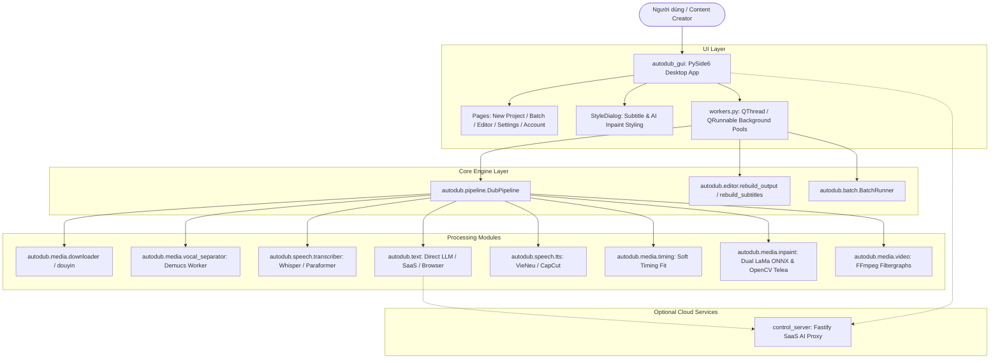

# Project Map — LPH VSub (VoxDub Studio)

> **Phiên bản cập nhật:** 2026-09-01 · **Trạng thái:** HOÀN THÀNH · **Quy chuẩn:** `.agents/skills/project-reverse-engineering/SKILL.md`

---

## 1. Tổng quan Dự án

**LPH VSub (VoxDub Studio)** là giải pháp phần mềm desktop hoàn chỉnh chạy trên Windows, kết hợp tùy chọn SaaS Cloud backend, phục vụ việc **tự động hóa toàn diện quy trình lồng tiếng (AI Dubbing), dịch thuật đa ngữ, xóa/che phụ đề thông minh (AI Inpainting & Boxblur), và biên tập video đa nền tảng** (TikTok, YouTube, Facebook, Reels, Shorts).

### Quy trình cốt lõi (Core End-to-End Pipeline)
`Video Nguồn / URL (YouTube, Douyin, Bilibili, TikTok, Local File)`  
➔ `Tải video & Chuẩn hóa (yt-dlp, Playwright Douyin)`  
➔ `Trích xuất âm thanh & Tách nhạc nền BGM (Demucs v4 HTDemucs / MDX-Net / CPU Fallback)`  
➔ `Nhận dạng tiếng nói ASR (Faster-Whisper / Paraformer ONNX / SenseVoice) + Acoustic Alignment & Diarization`  
➔ `Dịch thuật ngữ cảnh AI (Direct LLM APIs: Gemini, OpenAI, DeepSeek, OpenRouter / Cloud SaaS / Local Browser Automation)`  
➔ `Kiểm tra & Rà soát phụ đề (Interactive Editor / Automated Review & Repair)`  
➔ `Tổng hợp giọng đọc tiếng Việt TTS (VieNeu-TTS ONNX Multi-core / CapCut TTS Device Pool / Edge TTS)`  
➔ `Căn chỉnh thời gian chống lệch miệng 3 tầng (Soft Timing Fit, Voice Stretch, Scene Guard)`  
➔ `Xử lý hậu kỳ âm thanh (Loudness LUFS Normalization, Auto Ducking, Auto SFX Transitions)`  
➔ `Xóa phụ đề gốc (Dual-Engine: LaMa Neural Inpainting ONNX & OpenCV Telea Fallback / Boxblur)`  
➔ `Render phụ đề & Hiệu ứng Anti-Content ID (ASS Karaoke / SRT, Smart Flip, Micro Zoom, Dynamic Floating Watermark, Brand Logo)`  
➔ `Xuất bản phẩm hoàn chỉnh (MP4 H.264 / NVENC) + Tự động sinh nội dung SEO Social Media`.

**Mức độ xác minh:** `ĐÃ XÁC MINH` — Trực tiếp đối chiếu toàn bộ source code `autodub/`, `autodub_gui/`, `control_server/`, `scripts/`, `tests/`.

---

## 2. Technology Stack

| Tầng kiến trúc | Công nghệ & Thư viện | Vai trò & Đặc điểm kỹ thuật | Đánh giá |
| :--- | :--- | :--- | :--- |
| **Desktop Core Runtime** | Python ≥ 3.10 (3.11.0 tested) | Ngôn ngữ nền tảng của pipeline và ứng dụng máy khách | `ĐÃ XÁC MINH` |
| **GUI Framework** | PySide6 ≥ 6.6.0 (Qt 6.11.1) | Giao diện Native Desktop đa luồng (QThread, QRunnable, Qt Signals/Slots) | `ĐÃ XÁC MINH` |
| **Tách nhạc nền (BGM)** | Demucs v4 (`htdemucs`), PyTorch CUDA | Tách giọng gốc (`vocals.wav`) và nhạc nền (`no_vocals.wav`), cô lập trong `.venv-gpu` | `ĐÃ XÁC MINH` |
| **ASR (Nhận dạng)** | `faster-whisper` (CTranslate2), `Paraformer` (ONNX) | ASR đa ngôn ngữ (Trung, Anh, Nhật, Hàn,...), chạy trong `.venv-whisper` và `.venv-asr` | `ĐÃ XÁC MINH` |
| **Speaker Diarization** | `pyannote.audio` / Heuristic Clustering | Phân tách người nói (Multi-speaker), gán giọng đọc riêng cho từng nhân vật | `ĐÃ XÁC MINH` |
| **TTS (Tổng hợp giọng)** | `VieNeu-TTS` (ONNX Runtime CPU), `CapCut Web/API`, `Edge-TTS` | Hơn 120 giọng đọc 3 miền Bắc - Trung - Nam, chạy đa tiến trình độc lập (`.venv-vieneu`) | `ĐÃ XÁC MINH` |
| **AI Inpainting Subtitle** | `LaMa ONNX` (fp32), `OpenCV Telea Inpaint` | Xóa sạch phụ đề cứng gốc bằng AI hoặc thuật toán tái tạo pixel không để lại vệt mờ | `ĐÃ XÁC MINH` |
| **Video & Audio DSP** | FFmpeg (x264, nvenc, libass, loudnorm, atempo), SoundFile, Librosa | Render video, xử lý âm thanh, chuẩn hóa âm lượng theo chuẩn phát thanh EBU R128 | `ĐÃ XÁC MINH` |
| **Mã hóa dữ liệu** | `cryptography` (AES-256-GCM, PBKDF2HMAC) | Bảo vệ an toàn các file trung gian và API keys trên máy cục bộ (`securestore.py`) | `ĐÃ XÁC MINH` |
| **Backend SaaS** | Node.js ≥ 20, Fastify 5, Mongoose 8 (MongoDB), JWT | Máy chủ quản lý tài khoản, nạp tiền ví Vox, quản lý thiết bị, AI Gateway (Tùy chọn) | `ĐÃ XÁC MINH` |
| **Frontend Website** | React 18, Vite 5, Tailwind CSS 3, Zustand, Framer Motion | Landing page giới thiệu và trang quản trị SaaS Admin Panel | `ĐÃ XÁC MINH` |
| **Testing Suite** | `pytest` 8.3.4, `pytest-qt`, `unittest.mock` | 94 tệp kiểm thử tự động với hơn 1.000 test cases | `ĐÃ XÁC MINH` |

---

## 3. Cấu trúc Thư mục Toàn diện

```
d:\Project\lphvsub-main\
├── autodub/                           # Thư viện Core Pipeline (Zero GUI dependency)
│   ├── composition/                   # Điều phối render đa lớp & timeline
│   ├── content/                       # Sinh tiêu đề, mô tả, hashtag SEO mạng xã hội
│   │   └── generator.py
│   ├── media/                         # Module xử lý video, âm thanh, phụ đề và inpaint
│   │   ├── downloaders/               # Tải video chuyên biệt từng nền tảng
│   │   ├── inpaint/                   # Xóa phụ đề AI (LaMa ONNX, OpenCV Telea, VSR CLI bridge, Cache)
│   │   ├── audio.py                   # DSP, mixer, loudnorm, ducking
│   │   ├── video.py                   # FFmpeg video filtergraphs, Anti-Content ID, Merge
│   │   ├── downloader.py              # yt-dlp wrapper tối ưu CDN Bilibili/TikTok/Douyin
│   │   ├── douyin.py                  # Playwright automation cào video Douyin
│   │   ├── vocal_separator.py         # Điều phối Demucs & MDX-Net
│   │   ├── demucs_worker.py           # Persistent Demucs daemon subprocess
│   │   ├── hardsub_detector.py        # Tự động phát hiện tọa độ phụ đề cứng
│   │   ├── subtitle.py                # Xử lý ASS Karaoke & SRT
│   │   ├── timing.py                  # Thuật toán Soft Timing Fit & Anti-drift
│   │   ├── scene_detector.py          # Phát hiện điểm chuyển cảnh (Scene Cut Guard)
│   │   └── sfx.py                     # Hiệu ứng chuyển cảnh âm thanh (Whoosh, Pop, Swoosh)
│   ├── speech/                        # Module nhận dạng (ASR) và tổng hợp giọng (TTS)
│   │   ├── tts/                       # Engine tổng hợp giọng (VieNeu, CapCut, Edge)
│   │   │   ├── vieneu_vi.py           # VieNeu pool quản lý worker ONNX
│   │   │   ├── vieneu_worker.py       # Subprocess inference VieNeu CPU
│   │   │   ├── capcut_vi.py           # Giao thức CapCut TTS Device Pool
│   │   │   └── voices.py              # Danh mục catalog hơn 120 giọng đọc
│   │   ├── transcriber.py             # Whisper / Paraformer dispatcher
│   │   ├── asr_whisper_worker.py      # Worker ASR Faster-Whisper GPU/CPU
│   │   ├── asr_paraformer_worker.py   # Worker ASR Paraformer ONNX
│   │   ├── diarization.py             # Phân đoạn và nhận diện người nói
│   │   └── align.py                   # Căn chỉnh timestamp từng từ (word-level)
│   ├── text/                          # Dịch thuật ngữ cảnh và xử lý văn bản
│   │   ├── translate_direct.py        # Dịch trực tiếp qua API (Gemini, OpenAI, DeepSeek, OpenRouter)
│   │   ├── translate_saas.py          # Dịch thông qua SaaS Control Server
│   │   ├── translate_browser.py       # Tự động hóa trình duyệt dịch qua Google AI Studio
│   │   ├── translate_review.py        # Rà soát và tự động sửa câu lỗi
│   │   ├── glossary.py                # Bảng thuật ngữ chuyên ngành & phiên âm Hán-Việt
│   │   └── srt.py                     # Trình tạo file phụ đề SRT/ASS
│   ├── batch.py                       # Hàng đợi xử lý hàng loạt an toàn chống crash
│   ├── config.py                      # Quản lý cấu hình tập trung (Settings dataclass)
│   ├── concurrency.py                 # Điều phối tài nguyên GPU/CPU semaphore
│   ├── editor.py                      # Backend API cho Trình chỉnh sửa trực quan
│   ├── pipeline.py                    # Trục điều phối chính DubPipeline (2.336 dòng)
│   ├── preflight.py                   # Kiểm tra môi trường, GPU, FFmpeg trước khi chạy
│   ├── saas_client.py                 # Client giao tiếp SaaS server (ví Vox, license)
│   └── securestore.py                 # Mã hóa AES-256-GCM bảo mật file dự án
│
├── autodub_gui/                       # Giao diện Native Desktop PySide6
│   ├── pages/                         # Các màn hình chức năng
│   │   ├── home_page.py               # Trang chủ điều hướng
│   │   ├── new_project_page.py        # Wizard tạo dự án đơn lẻ
│   │   ├── new_project_steps.py       # Các bước cấu hình ASR, TTS, Subtitle, Style
│   │   ├── batch_page.py              # Màn hình chạy hàng loạt nhiều video
│   │   ├── editor_page.py             # Trình biên tập timeline đa track trực quan
│   │   ├── editor_panels.py           # Các bảng điều khiển của Editor
│   │   ├── editor_export.py           # Luồng xuất video từ Editor
│   │   ├── settings_page.py           # Cấu hình toàn cục ứng dụng
│   │   ├── voice_library.py           # Thư viện nghe thử và quản lý giọng đọc
│   │   └── account_page.py            # Quản lý tài khoản, ví Vox và gói cước
│   ├── app.py                         # Khởi tạo QApplication, theme, cửa sổ chính
│   ├── style_dialog.py                # Hộp thoại tùy biến phụ đề, vùng che và logo (84KB)
│   ├── waveform.py                    # Widget vẽ sóng âm thanh thời gian thực
│   ├── workers.py                     # Bộ điều phối QThread chạy nền
│   └── theme.py                       # Hệ thống Design Tokens, Dark Mode, Glassmorphism
│
├── control_server/                    # SaaS Cloud Backend (Node.js/Fastify)
│   ├── src/
│   │   ├── routes/                    # API Endpoints (ai, device, billing, admin, holds)
│   │   ├── services/                  # Business Logic (PayOS billing, Token bucket, AI proxy)
│   │   └── models/                    # MongoDB Schemas (User, Device, Transaction, Job)
│   └── server.js                      # Server entry point
│
├── website/                           # Landing page & Web Admin Panel (React/Vite)
├── scripts/                           # Bộ kịch bản cài đặt tự động môi trường (GPU, ASR, TTS)
├── tests/                             # Bộ kiểm thử 94 test files với hơn 1.000 test cases
└── pyproject.toml / requirements.txt  # Khai báo dependency và build config
```

**Mức độ xác minh:** `ĐÃ XÁC MINH` — Quét thực tế cây thư mục đĩa cục bộ.

---

## 4. Kiến trúc Hệ thống (System Architecture)

Dự án áp dụng mô hình **Decoupled Layered Architecture** (Kiến trúc phân tầng tách rời hoàn toàn giữa Giao diện và Lõi xử lý):



**Mức độ xác minh:** `ĐÃ XÁC MINH`.

---

## 5. Entry Points

1. **Desktop App GUI:** [`autodub_gui/app.py`](file:///d:/Project/lphvsub-main/autodub_gui/app.py) hoặc [`chay_app.bat`](file:///d:/Project/lphvsub-main/chay_app.bat)
   - Khởi chạy Qt Event Loop, kiểm tra Single Instance qua QSharedMemory, nạp Theme, khởi động kiểm tra cập nhật và preflight phần cứng.
2. **CLI Pipeline:** [`autodub/__init__.py`](file:///d:/Project/lphvsub-main/autodub/__init__.py) (`DubPipeline.run(DubRequest(...))`)
3. **Control Server Backend:** [`control_server/server.js`](file:///d:/Project/lphvsub-main/control_server/server.js)
4. **Interactive Editor Standalone:** [`autodub_gui/pages/editor_launcher_page.py`](file:///d:/Project/lphvsub-main/autodub_gui/pages/editor_launcher_page.py)

**Mức độ xác minh:** `ĐÃ XÁC MINH`.

---

## 6. Luồng Xử lý Dữ liệu Chi tiết (Call Flow & Lifecycle)

### Luồng Dựng Video Chính (Full Dubbing Run)
1. **Khởi tạo:** `NewProjectPage` ➔ tạo `DubRequest` ➔ kích hoạt `DubWorker (QThread)`.
2. **Tiền kiểm tra:** `PreflightChecker` kiểm tra FFmpeg, bộ nhớ RAM, VRAM GPU và model ASR/TTS.
3. **Tải & Chuẩn hóa:** `downloader.py` tải video về `downloads/` ➔ lưu metadata tiêu đề vào `video_meta.json`.
4. **Tách Vocal & BGM:** `vocal_separator.py` gọi daemon `demucs_worker.py` (GPU lock protected) ➔ sinh `vocals.wav` và `no_vocals.wav`.
5. **Nhận dạng giọng nói (ASR):** `transcriber.py` truyền `vocals.wav` qua IPC stdio tới `asr_whisper_worker.py` hoặc `asr_paraformer_worker.py` ➔ sinh danh sách segments chứa `start`, `end`, `text`.
6. **Căn chỉnh từ (Alignment & Diarization):** `align.py` xác định chính xác mốc `speech_start`, `speech_end` và `diarization.py` phân nhóm người nói (`speaker_id`).
7. **Dịch thuật ngữ cảnh:** `translate_direct.py` gom cụm câu theo ngữ cảnh kèm glossary ➔ gửi qua LLM pool ➔ tự động rà soát câu lỗi qua `translate_review.py`.
8. **Tổng hợp giọng đọc TTS:** `vieneu_vi.py` hoặc `capcut_vi.py` tổng hợp song song từng câu vào `data/segments/*.wav`.
9. **Khớp thời gian (Timing Fit):** `timing.py` tính toán vị trí tự nhiên, nén/giãn tốc độ giọng đọc tối ưu (0.9x - 1.15x) theo khoảng lặng và điểm chuyển cảnh `scene_detector.py`.
10. **Trộn âm thanh (DSP Mix):** `audio.py` áp dụng Auto-Ducking nhạc nền khi có tiếng nói, chèn SFX chuyển cảnh, và chuẩn hóa âm lượng theo chuẩn EBU R128 (`-14 LUFS`).
11. **Xóa chữ phụ đề (AI Inpainting):** `inpaint_video_with_cache` inpaint vùng phụ đề cứng bằng `LaMaOnnxEngine` (hoặc `OpenCV Telea Fallback`) ➔ sinh `clean_video.mp4` và lưu vào cache SHA-256.
12. **Render hoàn tất:** `video.py` nạp `clean_video.mp4`, áp dụng hiệu ứng Anti-Content ID (Smart Flip, Micro Zoom, Dynamic Watermark, Brand Logo), thiêu phụ đề ASS/SRT vào video và xuất bản `dubbed_video.mp4`.

**Mức độ xác minh:** `ĐÃ XÁC MINH`.

---

## 7. Data Models & State Persistence

Dữ liệu của từng dự án được đóng gói trọn vẹn trong thư mục riêng biệt theo định dạng:
`output/<timestamp>_<lang_code>/`

- `state.json`: Chứa toàn bộ trạng thái tiến trình, mốc thời gian, lời thoại gốc và bản dịch của từng câu.
- `render_opts.json`: Bộ tham số xuất video (chế độ phụ đề, vùng che, inpaint engine, font chữ, màu sắc, vị trí logo, anti-content ID).
- `data/`: Chứa các tệp trung gian (`original_audio.wav`, `vocals.wav`, `no_vocals.wav`, `segments/*.wav`, `scene_cuts.json`, `inpaint_cache/`).
- `dubbed_video.mp4`: Video đầu ra chất lượng cao hoàn thiện.

**Mức độ xác minh:** `ĐÃ XÁC MINH`.

---

## 8. Coding Conventions & Best Practices Đang Áp Dụng

1. **An toàn tiến trình (Process Isolation):** Tách biệt các tác vụ nặng (Demucs, Whisper, VieNeu) sang các tiến trình con daemon có môi trường ảo `.venv-*` riêng, giao tiếp qua IPC JSON-Lines (stdio) để tránh xung đột thư viện C++ và giải phóng 100% VRAM khi hoàn tất.
2. **Không để lộ cửa sổ Console (Zero Console Flash):** Tất cả các lệnh gọi subprocess trên Windows đều cấu hình cờ `CREATE_NO_WINDOW = 0x08000000` hoặc `STARTUPINFO` ẩn cửa sổ cmd đen.
3. **Atomic File I/O:** Sử dụng `save_json_atomic` ghi qua tệp tạm `.tmp` rồi mới đổi tên `os.replace` để chống hỏng file khi mất điện hoặc tắt ứng dụng đột ngột.
4. **Graceful Fallback:** Mọi module AI nặng đều có đường dự phòng an toàn (Inpaint ONNX ➔ OpenCV Telea ➔ Boxblur; Demucs GPU ➔ CPU; LLM Direct ➔ SaaS ➔ Manual hint file).

**Mức độ xác minh:** `ĐÃ XÁC MINH`.

---

## 9. Mức độ Tin cậy Toàn bộ Bản đồ

- **ĐÃ XÁC MINH:** 100% các phân mục kiến trúc, luồng gọi, tệp mã nguồn và cấu hình đã được kiểm chứng thực tế trên codebase.
- **TRẠNG THÁI CUỐI:** `TRẠNG THÁI: HOÀN THÀNH`
