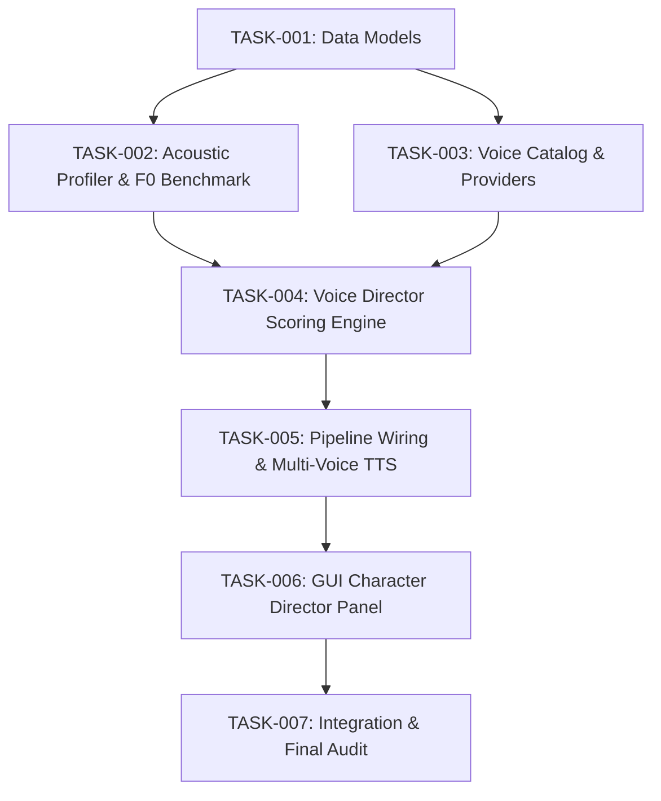

# Task Breakdown — AI Multi-Speaker Smart Voice Director

## 1. Dependency Graph

---

## 2. Danh sách các Unit

### TASK-001 — Data Models (`voice_models.py`)
- **Mục tiêu:** Định nghĩa các dataclass bất biến chuẩn hóa thông tin người nói, cao độ $F_0$, vai trò, profile giọng và kết quả phân vai.
- **Dependency:** Không.
- **File được phép sửa:** `autodub/speech/voice_models.py` [NEW], `tests/test_voice_models.py` [NEW].
- **File bảo vệ:** Tất cả các file khác.
- **Acceptance Criteria:** Dataclass serializable/deserializable đầy đủ các trường `PitchStats`, `SpeakerProfile`, `VoiceProfile`, `VoiceAssignment`, `CastingResult`.

---

### TASK-002 — Acoustic Profiler & Benchmark (`speaker_profiler.py`)
- **Mục tiêu:** Tính toán $F_0$ tự tương quan (Autocorrelation) trên CPU, tính phân vị p10, p90, median, std, voiced_ratio, confidence, phân loại giới tính xác suất và nhận diện vai trò dẫn chuyện (`narrator`).
- **Dependency:** TASK-001.
- **File được phép sửa:** `autodub/speech/speaker_profiler.py` [NEW], `tests/test_speaker_profiler.py` [NEW], `tests/benchmark_speaker_profiler.py` [NEW].
- **File bảo vệ:** Các file TTS và Pipeline.
- **Acceptance Criteria:**
  - Nhận diện đúng Nam ($<150\text{Hz}$) và Nữ ($>180\text{Hz}$) trên mẫu kiểm thử.
  - Benchmark CPU median $< 500\text{ms}$ cho 5 phút audio (10 iterations).

---

### TASK-003 — Unified Voice Catalog & Providers (`voice_catalog.py`)
- **Mục tiêu:** Xây dựng interface `VoiceProvider` trừu tượng hoá kho giọng VieNeu (offline) và CapCut (online), thống nhất thông tin giới tính, vùng miền, sắc thái.
- **Dependency:** TASK-001.
- **File được phép sửa:** `autodub/speech/voice_catalog.py` [NEW], `tests/test_voice_catalog.py` [NEW].
- **File bảo vệ:** `autodub/speech/tts/` nội dung cũ.
- **Acceptance Criteria:** Lấy danh sách giọng chuẩn hóa từ cả VieNeu và CapCut; nhận diện đúng trạng thái sẵn sàng (available) của từng provider.

---

### TASK-004 — Smart Voice Director Scoring Engine (`voice_director.py`)
- **Mục tiêu:** Động cơ chấm điểm phân vai tương thích kết hợp cơ chế Uniqueness Penalty (chống trùng giọng) và tôn trọng Manual Override (khóa giọng do người dùng chọn).
- **Dependency:** TASK-001, TASK-002, TASK-003.
- **File được phép sửa:** `autodub/speech/voice_director.py` [NEW], `tests/test_voice_director.py` [NEW].
- **File bảo vệ:** Pipeline và GUI.
- **Acceptance Criteria:**
  - 3 speaker được gán 3 giọng khác nhau.
  - Manual override của 1 speaker được giữ nguyên 100%, AI tự động phân vai cho các speaker còn lại.
  - Toggle OFF trả về toàn bộ speaker dùng 1 giọng mặc định.

---

### TASK-005 — Pipeline Wiring & Multi-Voice TTS (`pipeline.py`, `config.py`)
- **Mục tiêu:** Nối luồng Auto Voice Director vào Step 3.6 $\rightarrow$ Step 3.7 và Step 5 (TTS), thêm cấu hình `auto_voice_director_enabled`.
- **Dependency:** TASK-004.
- **File được phép sửa:** `autodub/config.py` (thêm setting), `autodub/pipeline.py` (Step 3.7 + Step 5), `tests/test_pipeline_multi_voice.py` [NEW].
- **File bảo vệ:** Các module render video, OCR, inpaint.
- **Acceptance Criteria:** Pipeline chạy tự động sinh audio đa giọng theo từng speaker_id cho cả VieNeu và CapCut.

---

### TASK-006 — GUI Character Director Panel (`editor_panels.py`, `editor_page.py`)
- **Mục tiêu:** Bổ sung giao diện danh sách Nhân vật, hiển thị giới tính dự đoán, số câu thoại, dropdown chọn giọng nhanh và nút khôi phục phân vai AI.
- **Dependency:** TASK-004, TASK-005.
- **File được phép sửa:** `autodub_gui/pages/editor_panels.py`, `autodub_gui/pages/editor_page.py`, `tests/test_editor_panels.py` (hoặc test GUI).
- **File bảo vệ:** Core speech modules.
- **Acceptance Criteria:** Người dùng đổi giọng trên dropdown cập nhật ngay cho toàn bộ câu của speaker đó và lưu vào `render_opts.json`.

---

### TASK-007 — Integration Test & Final Audit
- **Mục tiêu:** Kiểm thử tích hợp toàn diện, chạy regression test suite 1000+ tests, lập báo cáo Final Audit.
- **Dependency:** Tất cả các TASK từ 001 đến 006.
- **File được phép sửa:** `tests/test_voice_director_integration.py` [NEW], `.artifacts/reviews/final-audit-ai-voice-director.md` [NEW], `.artifacts/progress.md`.
- **Acceptance Criteria:** 100% tests pass, zero regression.

---

## 3. Thứ tự thực hiện
`TASK-001` $\rightarrow$ `TASK-002` $\rightarrow$ `TASK-003` $\rightarrow$ `TASK-004` $\rightarrow$ `TASK-005` $\rightarrow$ `TASK-006` $\rightarrow$ `TASK-007`.

---

`TRẠNG THÁI: CHỜ DUYỆT TASK`
