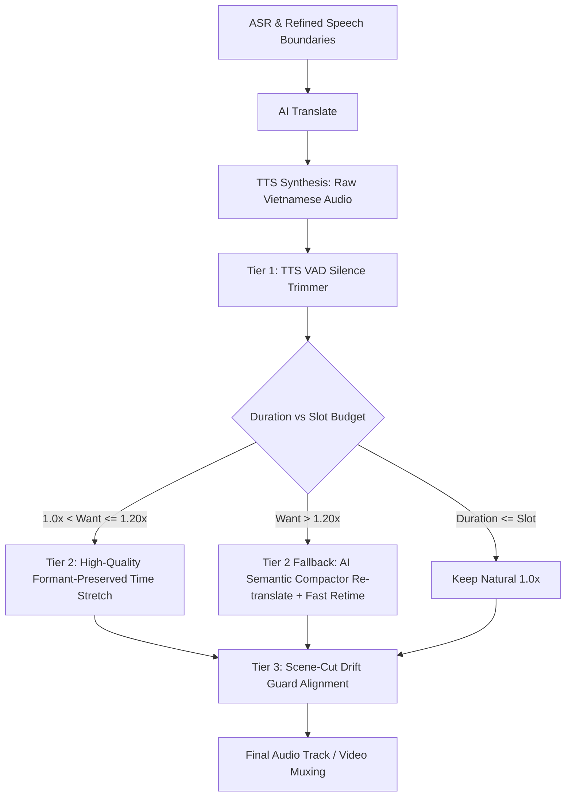

# Advanced 3-Tier Adaptive Voice Sync Design Specification

**Tài liệu thiết kế kiến trúc nâng cấp hệ thống Đồng bộ Giọng đọc Tiếng Việt (Voice Sync)**

---

## 1. Mục tiêu và Bối cảnh (Goal & Context)

Hệ thống lồng tiếng tự động (Autodub) tạo giọng đọc tiếng Việt từ video gốc (Trung/Anh/Hàn).
Thách thức cốt lõi: Câu dịch tiếng Việt thường có số lượng âm tiết dài hơn $15\% - 30\%$ so với tiếng Trung gốc. Nếu chỉ dùng thuật toán kéo nén `atempo` toàn cục, người nghe sẽ cảm thấy:
1. Giọng bị tăng tốc quá mức ($>1.15\times$) nghe như "sóc chuột" hoặc robot kim loại.
2. Clip TTS sinh ra mang theo các khoảng lặng đầu/đuôi (100–250ms) làm lãng phí khung thời gian quý giá.
3. Khi chuyển cảnh video (Scene Cut), âm thanh nhân vật câu trước bị nói tràn sang khuôn mặt nhân vật câu sau.

### Mục tiêu kiến trúc:
Xây dựng hệ thống **3-Tier Adaptive Voice Sync** gồm:
1. **Tier 1: VAD Silence Trimming & Micro-pause Optimization**: Tự động cắt sạch khoảng lặng thừa ở 2 đầu file TTS và co cụm khoảng nghỉ giữa các từ trước khi can thiệp tempo.
2. **Tier 2: Formant-Preserved Hybrid Time-Stretch & AI Semantic Compactor**:
   - Sử dụng bộ lọc giữ nguyên formants và chất âm ấm áp tự nhiên (WSOLA / Sonic / Rubberband fallback).
   - Tự động kích hoạt cơ chế rút gọn câu dịch bằng AI (Compact Translation) khi câu tiếng Việt dài vượt ngưỡng an toàn ($>1.25\times$).
3. **Tier 3: Scene-Cut Aware Drift Guard**: Nhận diện ranh giới cảnh quay (Scene Boundaries) bằng FFmpeg; không cho phép âm thanh đè qua điểm cắt cảnh của video.

---

## 2. Luồng xử lý chi tiết (3-Tier Pipeline Flow)

---

## 3. Thiết kế các thành phần (Component Architecture)

### 3.1. `autodub/speech/tts_trimmer.py` (VAD Silence Trimming)
- Đọc file audio đầu ra từ TTS.
- Dùng RMS energy analysis (khung 10ms, ngưỡng -26dB) để dò chính xác vị trí bắt đầu phát âm và kết thúc phát âm thật của diễn viên ảo.
- Trim bớt leading silence và trailing silence, chỉ để lại margin an toàn 25ms.
- Giúp giảm tức thì $8\% - 15\%$ thời lượng mà không làm thay đổi tốc độ nói.

### 3.2. `autodub/media/voice_stretch.py` (Formant-Preserved Time Stretch)
- Thay thế việc chỉ gọi đơn thuần `atempo` bằng pipeline thích ứng:
  - Khi $\text{tempo} \le 1.05$: Giữ nguyên hoặc dùng `atempo` nhẹ.
  - Khi $1.05 < \text{tempo} \le 1.25$: Dùng thuật toán WSOLA / Rubberband / `asetrate + atempo` để bảo toàn cao độ (pitch) và đặc tính giọng nói (formants), không gây vỡ tiếng hay méo dải tần cao.
  - Cung cấp fallback mượt mà nếu hệ thống thiếu thư viện mở rộng.

### 3.3. `autodub/text/compact_translator.py` (AI Semantic Compactor)
- Khi một câu dịch tiếng Việt được TTS tạo ra có thời lượng thực tế vượt $> 125\%$ thời lượng câu gốc (và sau khi đã trim silence vẫn không vừa):
- Hệ thống gửi prompt rút gọn nhanh về engine LLM:
  * *"Rút gọn câu sau thành bản dịch súc tích tối đa [N] từ mà vẫn giữ nguyên 100% ý nghĩa cốt lõi: {text}"*
- Tạo lại TTS cho riêng câu này với bản dịch cô đọng.

### 3.4. `autodub/media/scene_detector.py` (Scene-Cut Drift Guard)
- Trích xuất danh sách timestamps chuyển cảnh của video bằng FFmpeg `select='gt(scene,0.35)'`.
- Truyền danh sách `scene_cuts` vào `plan_voice_placements` trong `timing.py`.
- Nếu vị trí kết thúc dự kiến của câu lồng tiếng vượt qua điểm chuyển cảnh kế tiếp mà cảnh kế tiếp thuộc về đối tượng khác:
  * Tự động siết slot kết thúc trước điểm chuyển cảnh ít nhất 50ms (`hard_scene_boundary`).

---

## 4. Cấu hình & Tương thích ngược (Config & Settings)

Thêm các trường cấu hình mới vào `autodub/config.py` và `.env`:
- `VOICE_VAD_TRIM_ENABLED: bool = True` (Bật cắt tỉa khoảng lặng TTS)
- `VOICE_COMPACT_TRANSLATE_ENABLED: bool = True` (Tự động rút gọn câu dịch khi quá dài)
- `VOICE_SCENE_GUARD_ENABLED: bool = True` (Chặn tràn giọng qua điểm chuyển cảnh)
- `VOICE_MAX_SPEED: float = 1.20` (Trần tốc độ tối đa cho phép)

---

## 5. Kế hoạch kiểm thử (Testing & Quality Assurance)
1. `tests/test_tts_trimmer.py`: Kiểm tra cắt khoảng lặng đầu/đuôi chính xác tới từng mili-giây.
2. `tests/test_voice_stretch.py`: Kiểm tra độ méo tiếng, tỉ lệ stretch, bảo toàn pitch.
3. `tests/test_compact_translator.py`: Kiểm tra logic kích hoạt rút gọn câu dịch khi vượt slot budget.
4. `tests/test_scene_detector.py`: Kiểm tra phát hiện scene cuts và chặn drift ở ranh giới cảnh.
5. Kiểm tra toàn bộ test suite dự án đảm bảo $100\%$ không gây hồi quy (no regression).
