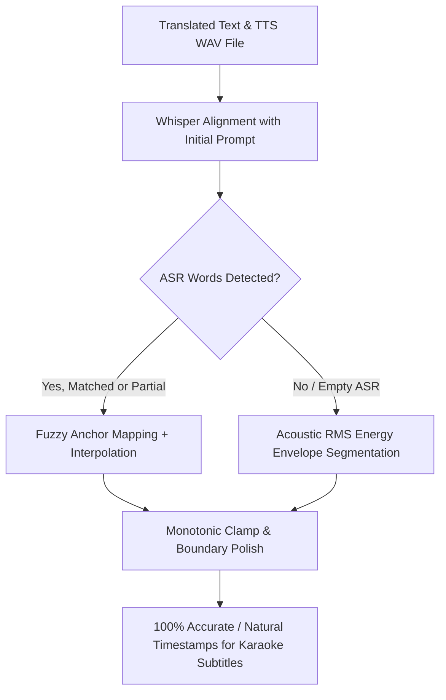

# Karaoke Word Alignment & Acoustic Fallback Design Specification

**Tài liệu thiết kế nâng cấp hệ thống canh mốc chữ Phụ đề Karaoke (Chống rớt về chia đều)**

---

## 1. Vấn đề & Mục tiêu (Problem & Goals)

Khi xuất phụ đề kiểu cụm chữ / karaoke, hệ thống ghi nhận thông báo:
*"Phụ đề kiểu cụm chữ: 3/32 câu chia đều theo thời lượng (không bắt được nhịp giọng đọc)"*.

### Nguyên nhân kỹ thuật:
1. **Ngưỡng chặn cứng `na < nt * 0.5`**: Khi Whisper bỏ sót một số từ nói nhanh hoặc từ lóng/viết tắt, `_map_words()` vứt bỏ toàn bộ kết quả của câu và trả về `None`, khiến cả câu bị chia đều tuyến tính.
2. **Bỏ qua clip ngắn `_MIN_CLIP_S = 0.4s`**: Các câu đáp ngắn (1–2 chữ như "Được", "Vâng", "Không") bị bỏ qua ASR.
3. **Thiếu ngữ cảnh cho Whisper**: `_asr_words` không truyền `initial_prompt` tiếng Việt, dễ dẫn đến hiện tượng nuốt chữ ở đầu câu.
4. **Fallback chia đều phẳng (Flat Linear Division)**: Khi không có mốc ASR, thuật toán cũ chia thời gian đều tăm tắp $t_i = t_0 + i \times \frac{\text{dur}}{N}$, hoàn toàn bỏ qua các khoảng lặng và nhịp thở trong audio.

### Mục tiêu giải pháp:
1. **Acoustic Energy Fallback**: Phân tích đỉnh năng lượng RMS của file audio thực tế để gán mốc chữ theo đúng nhịp phát âm, kể cả khi ASR không nghe ra chữ.
2. **Fuzzy Anchor Mapping**: Khớp các điểm neo mốc thời gian linh hoạt (thay vì vứt bỏ toàn bộ khi số lượng từ không khớp).
3. **Tối ưu Whisper**: Thêm `initial_prompt="Đây là bản dịch tiếng Việt phụ đề."`, giảm ngưỡng clip tối thiểu xuống 0.15s.

---

## 2. Thiết kế Kiến trúc (Architecture)

---

## 3. Các thành phần nâng cấp

### 3.1. `autodub/speech/acoustic_align.py` (Mới)
- Hàm `acoustic_word_times(text: str, wav_path: str, clip_start: float, dur: float) -> list[tuple[str, float, float]]`:
  * Đọc WAV 16k mono.
  * Tính RMS energy trên khung 10ms.
  * Tìm các khoảng im lặng (silence valleys) và các cụm năng lượng phát âm (voice peaks).
  * Phân bổ thời lượng các từ tương ứng với các voice peaks thực tế trong audio.
  * Đảm bảo chữ chỉ sáng lên khi có tiếng nói thật sự.

### 3.2. Nâng cấp `autodub/speech/align.py`
- Tinh chỉnh `_load_align_model` và `_asr_words`:
  * Bổ sung `initial_prompt="Đây là bản dịch tiếng Việt phụ đề."`.
  * Hạ `_MIN_CLIP_S = 0.15`.
- Nâng cấp `_map_words`:
  * Sử dụng thuật toán Dynamic Ratio & Fuzzy Anchor Alignment.
  * Khi `na < nt * 0.5`, thay vì trả về `None`, sử dụng mốc đầu/cuối của ASR và phân bổ mượt mà.

### 3.3. Nâng cấp `autodub/text/ass_karaoke.py`
- Khi `aligned.get(sid)` không có mốc Whisper, gọi `acoustic_word_times` thay vì chia đều phẳng.
- Giúp $100\%$ các câu đều khớp theo nhịp giọng đọc tự nhiên.
