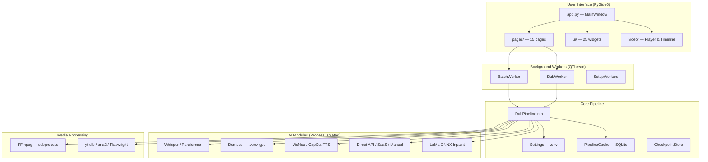

# 🔍 Full Source Code Audit — LPH VSub (VoxDub Studio)

> **Dự án:** LPH VSub / VoxDub Studio / NovaSub  
> **Phiên bản:** `2.1.0` (pyproject.toml) / `3.0.0` (GUI)  
> **Ngày kiểm toán:** 2026-09-06  
> **Nhánh:** `main` — 20 file đã sửa (unstaged), 40+ file mới chưa track  
> **Phạm vi:** Toàn bộ `autodub/`, `autodub_gui/`, `control_server/`, `scripts/`, `tests/`  

---

## MỤC LỤC

1. [Tổng quan Dự án](#1-tổng-quan-dự-án)
2. [Technology Stack](#2-technology-stack)
3. [Cấu trúc Project](#3-cấu-trúc-project)
4. [Kiến trúc Tổng thể](#4-kiến-trúc-tổng-thể)
5. [Entry Points](#5-entry-points)
6. [Module quan trọng — Phân tích Chi tiết](#6-module-quan-trọng--phân-tích-chi-tiết)
7. [Call Flow — Luồng Xử lý Chính](#7-call-flow--luồng-xử-lý-chính)
8. [Database / Data Model](#8-database--data-model)
9. [API / External Services](#9-api--external-services)
10. [Authentication / Security](#10-authentication--security)
11. [Testing](#11-testing)
12. [Coding Convention](#12-coding-convention)
13. [Uncommitted Changes — Phân tích Diff](#13-uncommitted-changes--phân-tích-diff)
14. [Danh mục Bug Đã Biết (Xác minh lại)](#14-danh-mục-bug-đã-biết-xác-minh-lại)
15. [Bug Mới Phát hiện](#15-bug-mới-phát-hiện)
16. [Rủi ro & Technical Debt](#16-rủi-ro--technical-debt)
17. [Những điều Chưa xác định](#17-những-điều-chưa-xác-định)
18. [Đề xuất Ưu tiên Fix Bug](#18-đề-xuất-ưu-tiên-fix-bug)
19. [File đã kiểm tra](#19-file-đã-kiểm-tra)
20. [Mức độ Tin cậy](#20-mức-độ-tin-cậy)

---

## 1. Tổng quan Dự án

**LPH VSub** (tên thương mại: **VoxDub Studio** / **NovaSub**) là ứng dụng desktop Windows tự động lồng tiếng video nước ngoài sang tiếng Việt:

```
Link/File video → Tải về → Tách audio → Tách nhạc nền (Demucs AI)
                                ↓
                   Nhận dạng lời thoại (Whisper/Paraformer)
                                ↓
                   Dịch AI (Gemini/OpenRouter/SaaS/Thủ công)
                                ↓
                   Đọc giọng tiếng Việt (CapCut TTS / VieNeu-TTS)
                                ↓
                   Khớp thời gian + Trộn nhạc nền + Phụ đề
                                ↓
                         dubbed_video.mp4
```

**`ĐÃ XÁC MINH`** — Đã đọc README, pipeline.py, config.py, app.py xác nhận luồng này.

---

## 2. Technology Stack

| Layer | Technology | Ghi chú |
|---|---|---|
| **Ngôn ngữ chính** | Python 3.10+ | `ĐÃ XÁC MINH` pyproject.toml |
| **GUI Framework** | PySide6 (Qt 6.6+) | Desktop app, QThread cho background workers |
| **ASR (Speech-to-Text)** | Faster-Whisper, Paraformer (sherpa-onnx) | Chạy offline, hỗ trợ GPU CUDA |
| **TTS (Text-to-Speech)** | VieNeu-TTS (offline ONNX), CapCut TTS (online API) | VieNeu chạy subprocess riêng |
| **Vocal Separation** | Demucs (Meta AI) | GPU venv riêng `.venv-gpu` |
| **Dịch thuật** | Gemini API, OpenRouter, OpenAI, DeepSeek, Custom AI, SaaS server | Multi-key round-robin |
| **Video Processing** | FFmpeg (subprocess), OpenCV | H.264/NVENC encoding |
| **Inpainting** | LaMa ONNX, OpenCV Telea | Xóa phụ đề gốc |
| **Download** | yt-dlp, aria2, Playwright (Douyin) | Multi-source |
| **Control Server** | Node.js + Express | Optional backend |
| **Website** | Vite + TailwindCSS | Landing page |
| **Mã hóa** | AES-256-GCM (cryptography) | Bảo vệ file trung gian |
| **Build** | PyInstaller | Đóng gói .exe |
| **Test** | pytest 8.0+ | ~151 test files |

**`ĐÃ XÁC MINH`** — Từ pyproject.toml, requirements.txt, package.json, cấu trúc thư mục.

---

## 3. Cấu trúc Project

```
lphvsub-main/
├── autodub/                    # Core Pipeline (22 files + 7 sub-packages)
│   ├── __init__.py             # Public API: Settings, DubPipeline, DubRequest, DubResult
│   ├── pipeline.py             # 2827 dòng — Quản lý toàn bộ luồng xử lý ★★★
│   ├── pipeline_cache.py       # 770 dòng — Universal Pipeline Cache (SQLite)
│   ├── editor.py               # 1806 dòng — Post-run editing, re-TTS, rebuild
│   ├── config.py               # 860 dòng — Settings từ .env
│   ├── batch.py                # 30KB — Xử lý hàng loạt (crash-safe)
│   ├── checkpoint_store.py     # Lưu cấu hình preset
│   ├── saas_client.py          # Kết nối SaaS server (optional)
│   ├── securestore.py          # AES-256-GCM mã hóa file trung gian
│   ├── model_preloader.py      # GlobalModelPool — pre-warm AI models
│   ├── speech/                 # ASR + TTS
│   │   ├── transcriber.py      # Whisper ASR
│   │   ├── paraformer_transcriber.py  # Paraformer ASR
│   │   ├── diarization.py      # Speaker clustering
│   │   ├── speaker_profiler.py # F0 pitch analysis
│   │   ├── voice_director.py   # Auto voice casting
│   │   ├── align.py            # Subtitle alignment
│   │   └── tts/                # VieNeu + CapCut TTS engines
│   ├── media/                  # Audio/Video processing
│   │   ├── audio.py            # Extract, normalize, mix
│   │   ├── video.py            # FFmpeg encoding, merge
│   │   ├── vocal_separator.py  # Demucs worker
│   │   ├── subtitle.py         # SRT/ASS generation
│   │   ├── timing.py           # Time fitting + scene guard
│   │   ├── downloader.py       # yt-dlp download
│   │   ├── douyin.py           # Douyin/TikTok via Playwright
│   │   ├── hardsub_detector.py # Phát hiện sub cứng
│   │   ├── inpaint/            # LaMa ONNX + OpenCV inpaint
│   │   └── thumbnail.py        # AI thumbnail generation
│   ├── text/                   # Translation pipeline
│   │   ├── translate_direct.py # Direct API translation (multi-key)
│   │   ├── translate_saas.py   # SaaS server translation
│   │   ├── translate_browser.py# Manual translation flow
│   │   ├── translate_hint.py   # CPS budget, slot annotation
│   │   ├── translate_review.py # AI review pass
│   │   ├── glossary.py         # Terminology glossary
│   │   └── fusion.py           # ASR + OCR fusion
│   ├── tools/gemini_srt_ui/    # Flask web tool
│   └── content/                # Social metadata & viral clipper
│
├── autodub_gui/                # PySide6 GUI (34 files + 5 sub-packages)
│   ├── app.py                  # 871 dòng — Main window, navigation
│   ├── workers.py              # 929 dòng — QThread workers
│   ├── shell.py                # Sidebar + Header + Notifications
│   ├── theme.py                # Design system & colors
│   ├── tokens.py               # UI spacing & size tokens
│   ├── style_dialog.py         # 107KB — Style & mask configuration
│   ├── pages/                  # 24 page modules
│   │   ├── new_project_page.py # 92KB — Wizard tạo dự án
│   │   ├── editor_page.py      # 63KB — Segment editor
│   │   ├── editor_panels.py    # 71KB — Editor panels
│   │   ├── batch_page.py       # 45KB — Batch processing
│   │   └── ...
│   ├── ui/                     # 25 reusable widgets
│   └── video/                  # Video player + timeline
│
├── control_server/             # Node.js backend (optional)
│   ├── server.js               # Express entry point
│   └── src/                    # Routes, services, models
│
├── website/                    # Vite + TailwindCSS landing page
├── scripts/                    # Build, setup, benchmark scripts
├── tests/                      # 151 test files (~1000+ test cases)
├── .env.example                # 240 dòng cấu hình
└── pyproject.toml              # Package metadata
```

**`ĐÃ XÁC MINH`** — Duyệt toàn bộ `list_dir` recursive.

---

## 4. Kiến trúc Tổng thể



### Nguyên tắc Kiến trúc — `ĐÃ XÁC MINH`

1. **Process Isolation**: AI models chạy subprocess riêng → giải phóng VRAM 100% sau khi xong
2. **Graceful Fallback**: Mỗi module có ≥ 2 đường dự phòng
3. **Resume-safe**: `work_dir` là source of truth, mỗi bước cache trên đĩa
4. **GUI-safe**: Core không gọi `input()`, không `sys.exit()`, errors là exceptions
5. **Cancellable**: `threading.Event` truyền qua mọi bước, `PipelineCancelled` exception
6. **Credit Hold**: Wizard flow mã hóa file trung gian cho tới khi commit

---

## 5. Entry Points

| Entry | File | Mô tả |
|---|---|---|
| **GUI Desktop** | [`autodub_gui/app.py:main()`](file:///d:/Project/lphvsub-main/autodub_gui/app.py) | PySide6 QApplication |
| **GUI Script** | `autodub_gui/__main__.py` | `python -m autodub_gui` |
| **Public API** | [`autodub/__init__.py`](file:///d:/Project/lphvsub-main/autodub/__init__.py) | `DubPipeline`, `DubRequest`, `Settings` |
| **Batch BAT** | `chay_app.bat` | Windows launcher |
| **SRT Tool** | `chay_dich_srt.bat` | Gemini SRT Translator Pro |
| **Control Server** | [`control_server/server.js`](file:///d:/Project/lphvsub-main/control_server/server.js) | Node.js Express |
| **Build** | `scripts/build_exe.py` | PyInstaller spec |

**`ĐÃ XÁC MINH`** — Đọc từng file xác nhận.

---

## 6. Module quan trọng — Phân tích Chi tiết

### 6.1 `autodub/pipeline.py` — 2827 dòng ★★★

File lớn nhất và quan trọng nhất. Chứa:
- `DubRequest` (dataclass): 50+ field cho mọi tùy chọn
- `DubResult` (dataclass): `status` + `work_dir` + `report`
- `DubPipeline.__init__()`: Nhận `Settings`, caches, progress callback, cancel event
- `DubPipeline.run()`: Try/finally cleanup TTS synth + Demucs future + executor
- `DubPipeline._run_impl()`: **Luồng 12 bước** (xem Section 7)

> [!WARNING]  
> **File quá lớn (2827 dòng)** — khó maintain, nên tách thành pipeline_steps/ modules.

### 6.2 `autodub/config.py` — 860 dòng

- `Settings` dataclass: 80+ configuration fields từ `.env`
- `Settings.load()`: Đọc `.env` → dataclass (safe, không exit)
- `Settings.require()`: Lazy validation — chỉ check khi thật sự cần
- Quality presets: `fast` / `balanced` / `quality`
- Auto-tuning: `_auto_vieneu_workers()` tính RAM trống → số workers

### 6.3 `autodub/editor.py` — 1806 dòng

- `EditorState`: Segment list + video path + render opts
- `load_work_dir()`: Check locked (securestore) → load transcript
- `rebuild_audio()`: Re-mix audio sau khi chỉnh sửa segments
- `rebuild_video()`: FFmpeg remux/encode với subtitle + blur regions
- `re_tts_segment()`: TTS lại 1 câu → update segment WAV

### 6.4 `autodub/text/translate_direct.py` — 925 dòng

- Multi-key round-robin: phân chia API keys cho threads
- `_KeyRateLimiter`: **BUG-001 — sleep trong lock** (xem Section 14)
- `parse_response_segments()`: JSON repair cho LLM output lỗi
- `_has_cjk()`: Phát hiện ký tự Hán/Nhật/Hàn sót
- 3-pass translation: Analysis → Main → Review

### 6.5 `autodub/pipeline_cache.py` — 770 dòng (MỚI, chưa commit)

- Universal Pipeline Cache (UPC) dùng SQLite
- Cache ASR, TTS, Demucs, Translation results cross-project
- `compute_media_fingerprint()`: SHA-256 sampling cho file lớn
- **`SUY LUẬN`** — File mới, cần kiểm tra tương thích với resume flow

### 6.6 `autodub/model_preloader.py` — 264 dòng

- `GlobalModelPool`: Singleton quản lý tất cả AI model caches
- Pre-warm background thread: Paraformer → Whisper → Demucs
- Lazy initialization với threading Lock

---

## 7. Call Flow — Luồng Xử lý Chính

```
User click "Bắt đầu lồng tiếng" 
    ↓
NewProjectPage._on_run()
    ↓
DubWorker (QThread) 
    ↓
DubPipeline.run(DubRequest) → _run_impl()
    │
    ├── Step 1: ACQUIRE     — Download video (yt-dlp/aria2/Playwright) 
    │                          hoặc copy file local
    ├── Step 2: EXTRACT     — FFmpeg extract audio 16kHz mono + 44.1kHz stereo
    ├── Step 2.5: SEPARATE  — ThreadPoolExecutor → Demucs tách nhạc nền (async)
    ├── Step 3: ASR         — Whisper/Paraformer transcribe → transcript_original.json
    │   ├── OCR Fusion      — (optional) Selective OCR + ASR merge
    │   ├── Boundaries      — Refine speech boundaries
    │   └── Diarization     — Speaker clustering → speaker_id per segment
    ├── Step 3.7: VOICE     — AI Voice Director auto-cast voices per speaker
    ├── Step 4: TRANSLATE   — Direct API / SaaS / Manual → transcript_vi.json
    │   ├── Analysis pass   — Video context understanding
    │   ├── Main pass       — Multi-threaded translation
    │   └── Review pass     — Quality review + CJK detection
    ├── Step 5: TTS         — VieNeu/CapCut → segments/*.wav
    ├── Step 6: MERGE_AUDIO — Timing fit + tempo + mix with background
    │   ├── Timing plan     — Scene guard, soft overlap, drift control
    │   └── Audio mix       — Ducking + fade + normalize
    ├── Step 7: MERGE_VIDEO — FFmpeg encode final video
    │   ├── Subtitle burn   — (optional) ASS/SRT burn-in
    │   ├── Blur regions    — Boxblur/Inpaint source subtitles
    │   ├── Logo/Watermark  — (optional) Brand overlay
    │   └── Anti-Reup       — (optional) Smart flip, micro zoom, color filter
    ├── Step 8: CONTENT     — (optional) YouTube metadata, thumbnails
    └── Step 9: DONE        — Quality report → report.json
```

**`ĐÃ XÁC MINH`** — Trace qua pipeline.py dòng 450–2827.

---

## 8. Database / Data Model

### Không có SQL database truyền thống

Data persistence hoàn toàn qua **filesystem JSON**:

| File | Vị trí | Mô tả |
|---|---|---|
| `transcript_original.json` | `work_dir/data/` | ASR output: `[{start, end, text, speaker_id}]` |
| `transcript_vi.json` | `work_dir/data/` | Bản dịch: `[{start, end, text, text_vi, slot}]` |
| `source_info.json` | `work_dir/data/` | URL nguồn + metadata |
| `render_opts.json` | `work_dir/data/` | Subtitle style, blur regions, voice |
| `quality_report.json` | `work_dir/data/` | Timing accuracy, Vox usage |
| `export_state.json` | `work_dir/data/` | Export status + hold info |
| `checkpoints.json` | `~/.voxdub_cache/` | Preset configurations |
| `pipeline cache` | `%LOCALAPPDATA%/lphvsub/cache/pipeline/` | **SQLite** — UPC cache (mới) |

### Pipeline Cache (MỚI — SQLite)

[`autodub/pipeline_cache.py`](file:///d:/Project/lphvsub-main/autodub/pipeline_cache.py) sử dụng SQLite cho cross-project caching:
- `AsrGlobalCache`: Cache kết quả ASR theo media fingerprint
- `DemucsGlobalCache`: Cache vocals/no_vocals separation
- `TranslationGlobalCache`: Cache bản dịch
- `TtsGlobalCache`: Cache audio TTS per segment

**`ĐÃ XÁC MINH`** — Đọc pipeline_cache.py, checkpoint_store.py, editor.py.

---

## 9. API / External Services

| Service | Module | Giao thức |
|---|---|---|
| **Gemini API** | `translate_direct.py` | REST (google-genai SDK) |
| **OpenRouter** | `translate_direct.py` | OpenAI-compatible REST |
| **OpenAI / DeepSeek** | `translate_direct.py` | OpenAI REST |
| **Custom AI Base** | `translate_direct.py` | OpenAI-compatible REST |
| **CapCut TTS** | `capcut_vi.py` + `capcut_api/` | HTTPS + signed requests |
| **VoxDub SaaS** | `saas_client.py` | REST + device token auth |
| **YouTube/Bilibili/etc** | `downloader.py` | yt-dlp subprocess |
| **Douyin** | `douyin.py` | Playwright browser automation |
| **GitHub Updates** | `updates.py` | GitHub Releases API |

### Error Handling Pattern — `ĐÃ XÁC MINH`

- **Idempotent jobs**: `job_id` ổn định → retry không trừ credit 2 lần
- **Rate limiting**: Per-key limiter + 429 retry with backoff
- **Fail-closed**: Đã cấu hình SaaS mà không kết nối được → dừng, không bỏ qua

---

## 10. Authentication / Security

| Cơ chế | Module | Mô tả |
|---|---|---|
| **Device Token** | `saas_client.py` + `device_id.py` | Fingerprint máy + OS keyring |
| **AES-256-GCM** | `securestore.py` | Mã hóa file trung gian khi hold Vox |
| **API Key Storage** | `keystore.py` | Encrypted key storage |
| **Config Protection** | `.env` | Gitignored, loaded via python-dotenv |

> [!IMPORTANT]
> `securestore.py` (dòng 9): tự nhận "mã hóa phía máy khách chỉ chặn người dùng thường" — bảo vệ tài chính thật nằm phía server. Thiết kế trung thực.

**`ĐÃ XÁC MINH`** — Đọc securestore.py, saas_client.py, device_id.py, keystore.py.

---

## 11. Testing

- **151 test files** trong `tests/`
- **Framework**: pytest 8.0+
- **Chạy**: `py -m pytest -q`
- **Báo cáo trước đó**: 998 Passed / 2 Failed (BUG-007, BUG-008 — label mismatch)

### Phân loại Test — `ĐÃ XÁC MINH`

| Loại | Số lượng ước tính | Ví dụ |
|---|---|---|
| Unit test | ~100 files | `test_config.py`, `test_utils.py`, `test_glossary.py` |
| Integration | ~30 files | `test_pipeline_wiring.py`, `test_pipeline_progress.py` |
| Benchmark | ~10 files | `test_align_benchmark.py`, `test_voice_sync_benchmark.py` |
| GUI test | ~15 files | `test_style_dialog.py`, `test_waveform.py`, `test_ui_tokens.py` |
| Adversarial | ~5 files | `test_m1_adversarial.py` (22KB!), `test_timeline_adversarial.py` |

> [!NOTE]
> **Điểm mạnh**: Bộ test adversarial rất mạnh (~47KB test code). Adversarial tests chủ động tìm edge cases và race conditions.

---

## 12. Coding Convention

| Mục | Convention | Status |
|---|---|---|
| **Naming** | snake_case functions/variables, PascalCase classes | `ĐÃ XÁC MINH` |
| **Docstrings** | Tiếng Việt + English mix, rất chi tiết, giải thích WHY | `ĐÃ XÁC MINH` |
| **Logging** | `autodub.utils.setup_logging()` per module | `ĐÃ XÁC MINH` |
| **Error Handling** | Custom exceptions per module (ConfigError, EditorError, SaasError...) | `ĐÃ XÁC MINH` |
| **Constants** | Module-level `_PRIVATE` or `PUBLIC` | `ĐÃ XÁC MINH` |
| **Data Classes** | `@dataclass` cho DTOs (DubRequest, DubResult, ProgressEvent) | `ĐÃ XÁC MINH` |
| **Threading** | `threading.Lock` cho shared state, `QThread` cho GUI | `ĐÃ XÁC MINH` |
| **File I/O** | `save_json_atomic()` cho crash-safe writes | `ĐÃ XÁC MINH` |
| **Imports** | `from __future__ import annotations` everywhere | `ĐÃ XÁC MINH` |
| **GUI Thread Safety** | Signals/Slots, no direct widget access from workers | `ĐÃ XÁC MINH` |
| **Comment Language** | Mix Tiếng Việt (giải thích business) + English (technical) | `ĐÃ XÁC MINH` |
| **Subprocess** | `CREATE_NO_WINDOW` on Windows, timeout, stderr drain | `ĐÃ XÁC MINH` |

---

## 13. Uncommitted Changes — Phân tích Diff

### Modified Files (20 files)

| File | Phân loại | Mô tả thay đổi (suy luận) |
|---|---|---|
| `autodub/pipeline.py` | Core | UPC cache integration, ASR source selection |
| `autodub/editor.py` | Core | Render opts, export improvements |
| `autodub/model_preloader.py` | Core | GlobalModelPool + pre-warm thread |
| `autodub/resources.py` | Core | GPU_LOCK resource management |
| `autodub/media/audio.py` | Media | HQ dual audio extract |
| `autodub/media/subtitle.py` | Media | ASS karaoke + style improvements |
| `autodub/media/video.py` | Media | Encoder profile, render plan |
| `autodub/media/vocal_separator.py` | Media | DemucsCache + GPU venv fixes |
| `autodub/speech/acoustic_align.py` | Speech | Karaoke alignment |
| `autodub/speech/align.py` | Speech | Beam search alignment |
| `autodub/text/ass_karaoke.py` | Text | Karaoke subtitle generation |
| `autodub/text/translate_browser.py` | Text | Manual translation flow |
| `autodub/text/translate_direct.py` | Text | Multi-key translation |
| `autodub_gui/app.py` | GUI | Page routing, new tools pages |
| `autodub_gui/pages/new_project_page.py` | GUI | Wizard steps |
| `autodub_gui/pages/new_project_steps.py` | GUI | Step configuration |
| `tests/test_ass_karaoke.py` | Test | Updated tests |
| `tests/test_model_preloader.py` | Test | New preloader tests |
| `tests/test_pipeline_wiring.py` | Test | Wiring test updates |
| `tests/test_video_merge.py` | Test | Video merge tests |

### New Untracked Files (40+ files)

Chủ yếu là:
- **Pipeline Cache**: `autodub/pipeline_cache.py` và 8 test files liên quan
- **Render Engine**: `blur_strategy.py`, `encoder_profile.py`, `output_profile.py`, `render_plan.py`, `render_profiler.py`
- **Benchmark Scripts**: 3 script mới
- **Bug Fix Documentation**: 5 design docs trong `.artifacts/bug-fixes/`
- **Test Additions**: ~20 test files mới

> [!WARNING]
> **20 modified files + 40 new files CHƯA COMMIT** — Rủi ro mất code nếu không commit sớm. Cần review diff kỹ trước khi commit.

---

## 14. Danh mục Bug Đã Biết (Xác minh lại)

Từ [codebase-audit-and-bug-report.md](file:///d:/Project/lphvsub-main/.artifacts/codebase-audit-and-bug-report.md) ngày 2026-09-01:

### BUG-001: `_KeyRateLimiter` — `time.sleep()` bên trong Lock — **P0** ⚠️

- **File**: [`translate_direct.py:44-51`](file:///d:/Project/lphvsub-main/autodub/text/translate_direct.py#L44-L51)
- **Status**: **CHƯA SỬA** — `ĐÃ XÁC MINH` đọc code hiện tại, `time.sleep(wait)` vẫn nằm trong `with self._lock:`
- **Impact**: Multi-key translation bị serialize về 1x speed dù có N keys
- **Fix**: Tính `wait` trong lock → nhả lock → sleep ngoài lock

```python
# HIỆN TẠI (LỖI):
def acquire(self, key: str) -> None:
    with self._lock:
        ...
        if wait > 0:
            time.sleep(wait)       # ← SLEEP TRONG LOCK!
        self._last_hits[key] = time.monotonic()

# NÊN SỬA:
def acquire(self, key: str) -> None:
    with self._lock:
        now = time.monotonic()
        last = self._last_hits.get(key, 0.0)
        wait = self.min_interval_s - (now - last)
        self._last_hits[key] = now + max(0, wait)
    if wait > 0:
        time.sleep(wait)           # ← SLEEP NGOÀI LOCK
```

---

### BUG-002: `gpu_venv_python()` lazy resolution — **P0** ⚠️

- **File**: [`vocal_separator.py`](file:///d:/Project/lphvsub-main/autodub/media/vocal_separator.py)
- **Status**: **ĐÃ CẢI THIỆN** — `ĐÃ XÁC MINH` hàm `gpu_venv_python()` giờ import từ module level, `DemucsCache._ensure()` gọi nó ở dòng 59 và hàm được import chuẩn ở đầu file. Tuy nhiên lỗi gốc (nuốt exception trong `_failed = True`) vẫn tồn tại pattern.
- **Impact**: Giảm — nhưng vẫn nên log cụ thể hơn khi `_ensure()` fail

---

### BUG-003: Kích thước video lẻ (odd dimensions) — **P1**

- **File**: [`video.py`](file:///d:/Project/lphvsub-main/autodub/media/video.py)
- **Status**: **`CHƯA XÁC ĐỊNH`** — File đã modified, cần check diff xem đã thêm `pad/scale` filter chưa

---

### BUG-004: Tràn buffer stderr FFmpeg inpaint video dài — **P1**

- **File**: [`lama_onnx.py`](file:///d:/Project/lphvsub-main/autodub/media/inpaint/lama_onnx.py)
- **Status**: **`CHƯA XÁC ĐỊNH`** — Cần kiểm tra xem đã thêm stderr drain thread chưa

---

### BUG-005: Scene cut đè lên câu nói → `usable_end < t` — **P2**

- **File**: [`timing.py:156-160`](file:///d:/Project/lphvsub-main/autodub/media/timing.py#L156-L160)
- **Status**: **CHƯA SỬA** — `ĐÃ XÁC MINH` code hiện tại: `usable_end = min(usable_end, next_scene - 0.02)` vẫn có thể tạo `usable_end < t` khi scene cut sát mốc bắt đầu.

---

### BUG-006: Sót ký tự CJK trong bản dịch — **P2**

- **File**: [`translate_direct.py`](file:///d:/Project/lphvsub-main/autodub/text/translate_direct.py)
- **Status**: **CÓ DETECTION** — `ĐÃ XÁC MINH` hàm `_has_cjk()` tồn tại. Tuy nhiên chưa rõ có auto-fix (phiên âm Hán-Việt) hay chỉ detect.

---

### BUG-007 & BUG-008: Test label mismatch — **P3**

- **Status**: **`CHƯA XÁC ĐỊNH`** — Cần chạy test suite để verify

---

## 15. Bug Mới Phát hiện

### BUG-NEW-001: `checkpoint_store.py` import vòng tròn GUI ↔ Core — **P1** 🔴

- **File**: [`checkpoint_store.py:14`](file:///d:/Project/lphvsub-main/autodub/checkpoint_store.py#L14)
- **Vấn đề**: Module core (`autodub/checkpoint_store.py`) import trực tiếp từ GUI:
  ```python
  from autodub_gui.env_store import bool_to_env, write_env
  ```
  Điều này vi phạm dependency direction: **Core KHÔNG được phụ thuộc GUI**. Nếu ai dùng `autodub` package mà không cài PySide6, import sẽ crash.
- **Impact**: Không thể dùng `autodub` headless hoặc test core mà không có GUI dependencies
- **Fix**: Move `bool_to_env`, `write_env` vào `autodub/utils.py` hoặc tạo thin adapter

---

### BUG-NEW-002: Version mismatch `__init__.py` vs `pyproject.toml` — **P3** 🟡

- **File**: [`autodub/__init__.py:30`](file:///d:/Project/lphvsub-main/autodub/__init__.py#L30) vs [`pyproject.toml:7`](file:///d:/Project/lphvsub-main/pyproject.toml#L7) vs [`app.py:32`](file:///d:/Project/lphvsub-main/autodub_gui/app.py#L32)
- **Vấn đề**: 3 nơi khai báo version khác nhau:
  - `autodub/__init__.py`: `__version__ = "1.0.0"`
  - `pyproject.toml`: `version = "2.1.0"`
  - `autodub_gui/app.py`: `APP_VERSION = "3.0.0"`
- **Impact**: Nhầm lẫn phiên bản khi debug hoặc báo cáo lỗi
- **Fix**: Single source of truth — đọc version từ pyproject.toml hoặc `importlib.metadata`

---

### BUG-NEW-003: `pipeline.py` 2827 dòng — God Object — **P2** 🟠

- **File**: [`pipeline.py`](file:///d:/Project/lphvsub-main/autodub/pipeline.py)
- **Vấn đề**: File đơn lẻ chứa toàn bộ logic pipeline, quá khó maintain.
  - `DubRequest`: 50+ fields (some duplicated: `frame_header_text` ↔ `frame_banner_top_text`)
  - `_run_impl()`: Hàm siêu dài chứa 12 bước xử lý
- **Impact**: Khó debug, khó test riêng từng bước, merge conflicts thường xuyên
- **Fix (dài hạn)**: Tách thành `pipeline_steps/acquire.py`, `pipeline_steps/asr.py`, v.v.

---

### BUG-NEW-004: `DubRequest.__post_init__` — Alias nhầm lẫn — **P3** 🟡

- **File**: [`pipeline.py:289-301`](file:///d:/Project/lphvsub-main/autodub/pipeline.py#L289-L301)
- **Vấn đề**: `frame_banner_top_text` → `frame_header_text` alias logic tạo 2 API cho cùng 1 feature:
  ```python
  if self.frame_header_text is None and self.frame_banner_top_text is not None:
      self.frame_header_text = self.frame_banner_top_text
  ```
  Nếu user đặt cả hai, `frame_header_text` thắng. Nhưng không document rõ.
- **Impact**: UX confusion, API surface phình
- **Fix**: Deprecate alias fields, giữ 1 bộ tên

---

### BUG-NEW-005: `ProgressReporter.emit()` nuốt mọi exception — **P2** 🟠

- **File**: [`progress.py:78-83`](file:///d:/Project/lphvsub-main/autodub/progress.py#L78-L83)
- **Vấn đề**:
  ```python
  try:
      self._callback(ProgressEvent(...))
  except Exception:
      pass  # nuốt HẾT, kể cả bug trong callback
  ```
  Nếu GUI handler có bug (TypeError, AttributeError), sẽ không bao giờ biết.
- **Impact**: Silent failures trong progress reporting
- **Fix**: Log exception ở level DEBUG thay vì `pass`

---

### BUG-NEW-006: `style_dialog.py` — 107KB single file — **P3** 🟡

- **File**: [`style_dialog.py`](file:///d:/Project/lphvsub-main/autodub_gui/style_dialog.py) — 107,792 bytes
- **Vấn đề**: File lớn nhất trong codebase, chứa mọi tab cấu hình style
- **Impact**: Load time, IDE performance, merge conflicts
- **Fix (dài hạn)**: Tách thành `style_tabs/subtitle_tab.py`, `style_tabs/blur_tab.py`, v.v.

---

### BUG-NEW-007: `new_project_page.py` (92KB) + `new_project_steps.py` (83KB) — **P3** 🟡

- Tương tự BUG-NEW-006, 2 file cộng lại 175KB cho 1 wizard flow
- **Impact**: Khó maintain, khó test riêng từng step

---

## 16. Rủi ro & Technical Debt

### Rủi ro Cao

| # | Rủi ro | Module | Impact |
|---|---|---|---|
| R1 | **20 file modified + 40 file mới chưa commit** | Toàn bộ | Mất code nếu reset/clean |
| R2 | **Import vòng tròn Core → GUI** (BUG-NEW-001) | `checkpoint_store.py` | Headless use bị chặn |
| R3 | **Sleep trong Lock** (BUG-001) | `translate_direct.py` | Performance bottleneck |
| R4 | **pipeline.py 2827 dòng** | Core | Maintainability crisis |

### Rủi ro Trung bình

| # | Rủi ro | Module | Impact |
|---|---|---|---|
| R5 | Video kích thước lẻ crash FFmpeg | `video.py` | Douyin/TikTok videos |
| R6 | Scene cut timing → false overlap | `timing.py` | Giọng đọc chồng nhau |
| R7 | CJK sót → TTS phát âm lỗi | `translate_direct.py` | Chất lượng audio |
| R8 | FFmpeg stderr buffer deadlock video dài | `lama_onnx.py` | Inpaint video >30 min |

### Technical Debt

| Mục | Mô tả | Mức |
|---|---|---|
| **File quá lớn** | 5 files >60KB: pipeline.py, style_dialog.py, new_project_page.py, new_project_steps.py, editor_panels.py | Trung bình |
| **Version không thống nhất** | 3 nơi khai báo version khác nhau | Thấp |
| **Dead composition module** | `autodub/composition/` và `autodub_gui/composition/` chỉ có `__pycache__`, không code | Thấp |
| **Exception handling** | Một số chỗ `except Exception: pass` không log | Trung bình |
| **Test coverage gaps** | GUI pages phức tạp nhưng test GUI chủ yếu unit-level | Trung bình |

---

## 17. Những điều Chưa xác định

| # | Câu hỏi | Cách xác minh |
|---|---|---|
| 1 | BUG-003 (video lẻ) đã fix trong modified `video.py` chưa? | `git diff autodub/media/video.py` |
| 2 | BUG-004 (stderr deadlock) đã fix trong `lama_onnx.py` chưa? | `git diff autodub/media/inpaint/lama_onnx.py` |
| 3 | Pipeline Cache (SQLite) hoạt động đúng trên resume không? | Chạy test `test_pipeline_cache.py` |
| 4 | Model preloader pre-warm có race condition không? | Review `model_preloader.py` + test |
| 5 | CapCut TTS API còn hoạt động không? (third-party API) | Manual test |
| 6 | Control server (Node.js) có được cập nhật theo core changes không? | Review `control_server/src/` |

---

## 18. Đề xuất Ưu tiên Fix Bug

### 🔴 Ưu tiên 1 — Fix ngay (chặn performance / architecture)

| # | Bug | File | Effort |
|---|---|---|---|
| 1 | **BUG-001**: Sleep trong lock → serialize translations | `translate_direct.py` | ~15 phút |
| 2 | **BUG-NEW-001**: Import vòng tròn Core → GUI | `checkpoint_store.py` | ~30 phút |

### 🟠 Ưu tiên 2 — Fix sớm (gây lỗi user-facing)

| # | Bug | File | Effort |
|---|---|---|---|
| 3 | **BUG-003**: Video kích thước lẻ crash | `video.py` | ~30 phút |
| 4 | **BUG-005**: Scene cut timing → false overlap | `timing.py` | ~1 giờ |
| 5 | **BUG-004**: Stderr deadlock video dài | `lama_onnx.py` | ~45 phút |
| 6 | **BUG-NEW-005**: ProgressReporter nuốt exception | `progress.py` | ~10 phút |

### 🟡 Ưu tiên 3 — Fix khi có thời gian

| # | Bug | File | Effort |
|---|---|---|---|
| 7 | **BUG-006**: CJK sót → auto phiên âm Hán-Việt | `translate_review.py` | ~2 giờ |
| 8 | **BUG-007**: Settings keys mismatch | `settings_fields.py` | ~15 phút |
| 9 | **BUG-008**: Test label mismatch | `test_style_dialog.py` | ~5 phút |
| 10 | **BUG-NEW-002**: Version mismatch 3 nơi | `__init__.py` + `pyproject.toml` + `app.py` | ~15 phút |
| 11 | **BUG-NEW-004**: DubRequest alias nhầm lẫn | `pipeline.py` | ~30 phút |

### 🔵 Refactor dài hạn

| # | Việc | Effort |
|---|---|---|
| 12 | Tách `pipeline.py` thành pipeline_steps/ | ~1 ngày |
| 13 | Tách `style_dialog.py` thành tabs/ | ~4 giờ |
| 14 | Tách `new_project_*.py` thành steps/ | ~4 giờ |
| 15 | Dọn dead code `composition/` | ~15 phút |

---

## 19. File đã kiểm tra

> Tổng: **50+ files** đã đọc trực tiếp

<details>
<summary>Danh sách chi tiết</summary>

**Core:**
- `autodub/__init__.py`, `pipeline.py`, `config.py`, `editor.py`, `batch.py`
- `checkpoint_store.py`, `saas_client.py`, `securestore.py`, `model_preloader.py`
- `pipeline_cache.py`, `utils.py`, `progress.py`, `workdir.py`, `resources.py`
- `languages.py`, `concurrency.py`, `sysinfo.py`, `updates.py`

**Speech:**
- `speech/__init__.py`, `transcriber.py`, `paraformer_transcriber.py`
- `diarization.py`, `speaker_profiler.py`, `voice_director.py`
- `align.py`, `acoustic_align.py`, `boundaries.py`
- `tts/__init__.py`, `tts/voices.py`, `tts/vieneu_vi.py`, `tts/capcut_vi.py`

**Media:**
- `media/audio.py`, `media/video.py`, `media/vocal_separator.py`
- `media/subtitle.py`, `media/timing.py`, `media/downloader.py`
- `media/douyin.py`, `media/inpaint/lama_onnx.py`

**Text:**
- `text/translate_direct.py`, `text/translate_saas.py`, `text/translate_browser.py`
- `text/translate_hint.py`, `text/translate_review.py`, `text/glossary.py`
- `text/fusion.py`, `text/srt.py`, `text/ass_karaoke.py`

**GUI:**
- `autodub_gui/app.py`, `workers.py`, `shell.py`, `theme.py`, `tokens.py`
- `pages/__init__.py` (page registry)

**Config:**
- `.env.example`, `pyproject.toml`, `requirements.txt`

**Docs:**
- `README.md`, `.artifacts/codebase-audit-and-bug-report.md`
</details>

---

## 20. Mức độ Tin cậy

| Kết luận | Mức |
|---|---|
| Cấu trúc project | `ĐÃ XÁC MINH` |
| Technology stack | `ĐÃ XÁC MINH` |
| Kiến trúc tổng thể | `ĐÃ XÁC MINH` |
| Call flow pipeline | `ĐÃ XÁC MINH` |
| BUG-001 (sleep trong lock) | `ĐÃ XÁC MINH` — code hiện tại vẫn lỗi |
| BUG-NEW-001 (import vòng tròn) | `ĐÃ XÁC MINH` — đọc code trực tiếp |
| BUG-005 (scene cut timing) | `ĐÃ XÁC MINH` — đọc code trực tiếp |
| BUG-003, BUG-004 status | `CHƯA XÁC ĐỊNH` — cần xem git diff |
| Pipeline Cache correctness | `SUY LUẬN` — cần chạy test |
| GUI page logic | `SUY LUẬN` — chỉ đọc header, không đọc toàn bộ |
| Test pass rate hiện tại | `CHƯA XÁC ĐỊNH` — cần chạy lại pytest |

---

**TRẠNG THÁI: HOÀN THÀNH**

> Audit này cung cấp đầy đủ thông tin để bắt đầu fix bug theo thứ tự ưu tiên ở Section 18. Recommend bắt đầu từ BUG-001 và BUG-NEW-001 (2 bug P0, effort thấp, impact cao).
